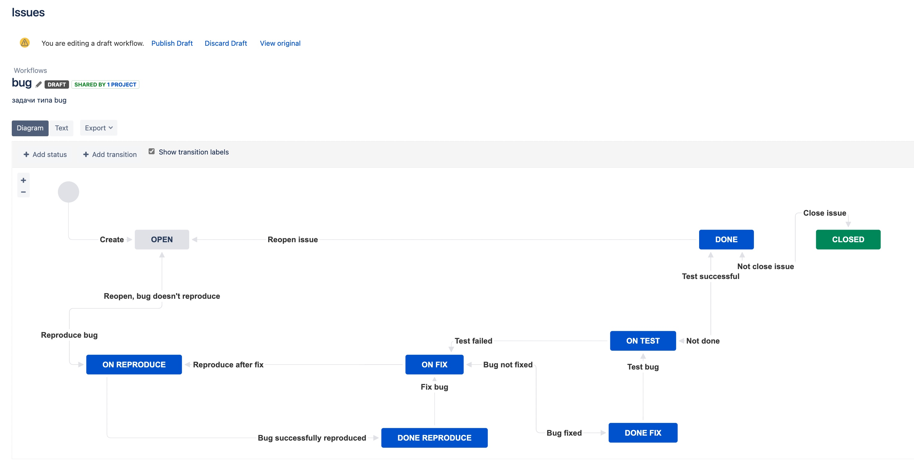
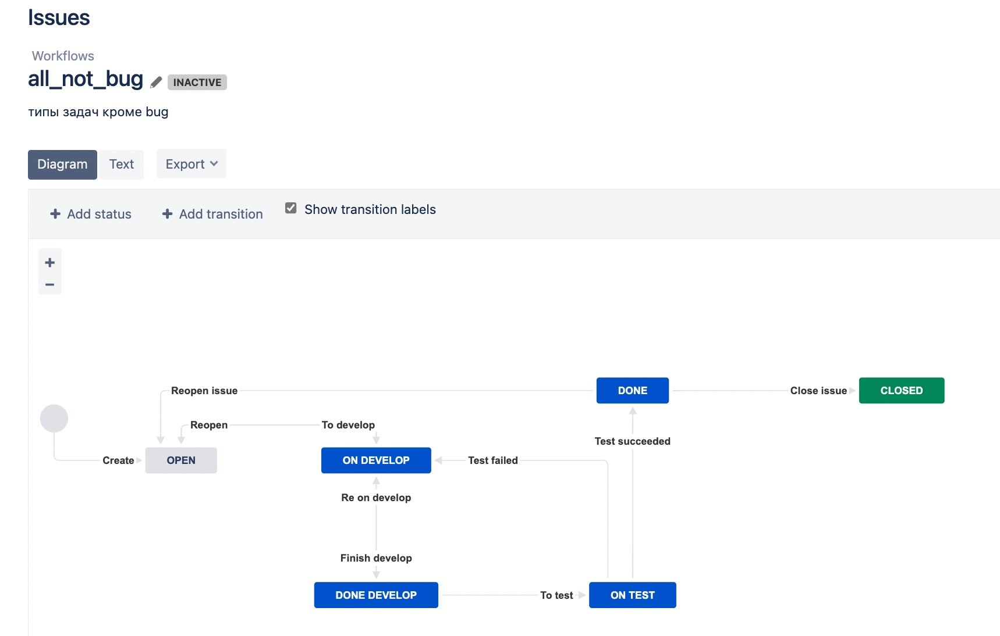
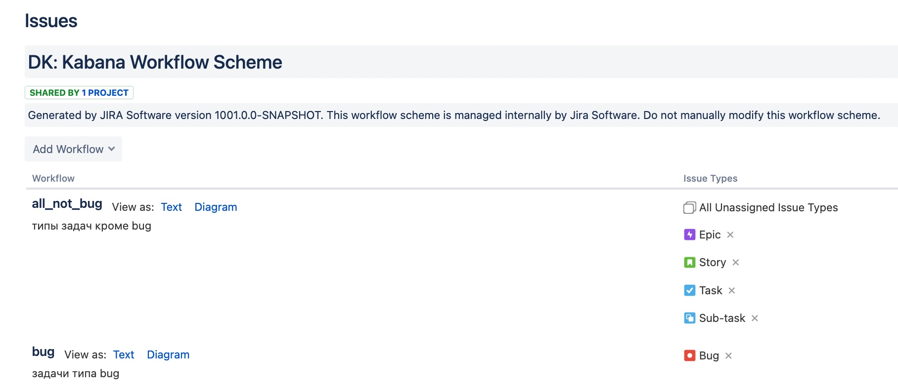

### Домашнее задание к занятию "09.01 Жизненный цикл ПО"

#### Подготовка к выполнению

* Получить бесплатную версию Jira - https://www.atlassian.com/ru/software/jira/work-management/free (скопируйте ссылку в адресную строку). Вы можете воспользоваться любым(в том числе бесплатным vpn сервисом) если сайт у вас недоступен. Кроме того вы можете скачать docker образ и запустить на своем хосте self-managed версию jira.
* Настроить её для своей команды разработки.
* Создать доски Kanban и Scrum.
* Дополнительные инструкции от разработчика Jira.

```
kanban = Projects -> Create project -> Kanban -> Use template -> Company-managed -> Create project
```

```
scrum = Projects -> Create project -> Scrum -> Use template -> Company-managed -> Create project
```

#### Основная часть
В рамках основной части необходимо создать собственные workflow для двух типов задач: bug и остальные типы задач. Задачи типа bug должны проходить следующий жизненный цикл:
1. Open -> On reproduce
2. On reproduce <-> Open, Done reproduce
3. Done reproduce -> On fix
4. On fix <-> On reproduce, Done fix
5. Done fix -> On test
6. On test <-> On fix, Done
7. Done <-> Closed, Open
```
Settings -> Issues -> Workflows -> Add workflow -> bug
```



Остальные задачи должны проходить по упрощённому workflow:
1. Open -> On develop
2. On develop <-> Open, Done develop
3. Done develop -> On test
4. On test <-> On develop, Done
5. Done <-> Closed, Open
```
Settings -> Issues -> Workflows -> Add workflow -> all_not_bug
```



Схема Workflow



* Создать задачу с типом bug, попытаться провести его по всему workflow до Done. 
* Создать задачу с типом epic, к ней привязать несколько задач с типом task, провести их по всему workflow до Done. 
* При проведении обеих задач по статусам использовать kanban. Вернуть задачи в статус Open.
* Перейти в scrum, запланировать новый спринт, состоящий из задач эпика и одного бага, стартовать спринт, провести задачи до состояния Closed. Закрыть спринт.
* Если всё отработало в рамках ожидания - выгрузить схемы workflow для импорта в XML. Файлы с workflow приложить к решению задания.
[bug](bug.xml)
[all_not_bug](all_not_bug.xml)