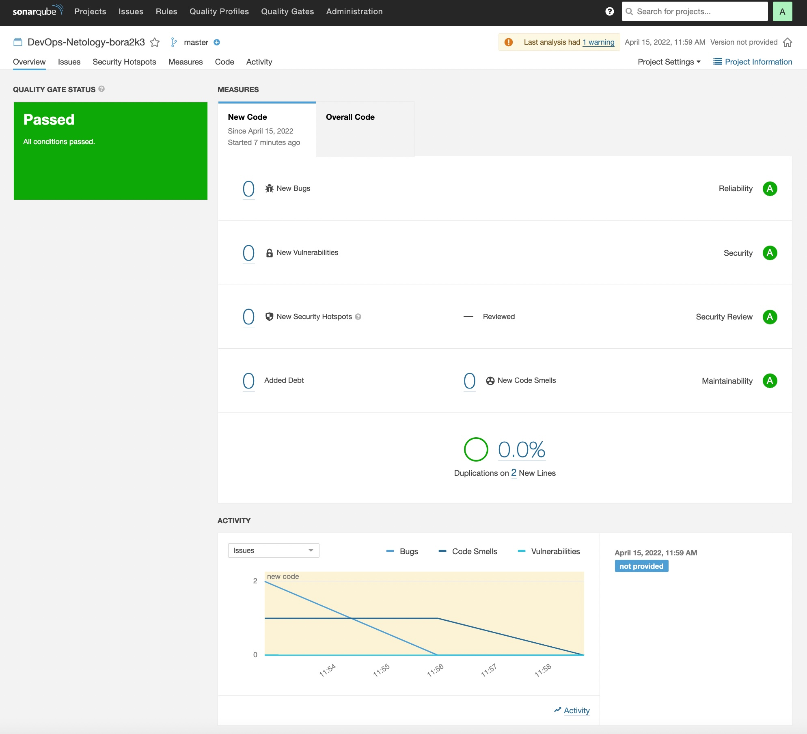

# Домашнее задание к занятию 9 «Процессы CI/CD»

## Подготовка к выполнению

* Создайте два VM в Yandex Cloud с параметрами: 2CPU 4RAM Centos7 (остальное по минимальным требованиям).
* Пропишите в inventory playbook созданные хосты.
* Добавьте в files файл со своим публичным ключом (id_rsa.pub). Если ключ называется иначе — найдите таску в плейбуке, которая использует id_rsa.pub имя, и исправьте на своё.
* Запустите playbook, ожидайте успешного завершения.
* Проверьте готовность SonarQube через браузер.
* Зайдите под admin\admin, поменяйте пароль на свой.
* Проверьте готовность Nexus через бразуер.
* Подключитесь под admin\admin123, поменяйте пароль, сохраните анонимный доступ.

## Знакомоство с SonarQube.

### Основная часть.

* Создайте новый проект, название произвольное.
* Скачайте пакет sonar-scanner, который вам предлагает скачать SonarQube.
* Сделайте так, чтобы binary был доступен через вызов в shell (или поменяйте переменную PATH, или любой другой, удобный вам способ).

``` ini
 install_directory=~/Netology/09-ci-02-cicd/SonarQube/sonar-scanner-4.7.0.2747-linux
```

* Проверьте sonar-scanner --version.

``` ini
$ sonar-scanner --version
INFO: Scanner configuration file: /Netology/09-ci-02-cicd/SonarQube/sonar-scanner-4.7.0.2747-linux/conf/sonar-scanner.properties
INFO: Project root configuration file: NONE
INFO: SonarScanner 4.7.0.2747
INFO: Java 11.0.14.1 Eclipse Adoptium (64-bit)
INFO: Linux 4.19.0-18-amd64 amd64
```

* Запустите анализатор против кода из директории example с дополнительным ключом `-Dsonar.coverage.exclusions=fail.py`.

``` ini
$ sonar-scanner \
>   -Dsonar.projectKey=DevOps-Netology-bora2k3 \
>   -Dsonar.sources=. \
>   -Dsonar.host.url=http://xxx.xxx.xxx.xxx:9000 \
>   -Dsonar.login=eb038f18xxxxxxxxxxxxxxxx177d77c045f28d5c \
>   -Dsonar.coverage.exclusions=fail.py
```

* Посмотрите результат в интерфейсе.
* Исправьте ошибки, которые он выявил, включая warnings.
* Запустите анализатор повторно — проверьте, что QG пройдены успешно.
* Сделайте скриншот успешного прохождения анализа, приложите к решению ДЗ.


## Знакомство с Nexus.

### Основная часть.

#### В репозиторий maven-public загрузите артефакт с GAV-параметрами:

* groupId: `netology`;
* artifactId: `java`;
* version: `8_282`;
* classifier: `distrib`;
* type: `tar.gz`.

* В него же загрузите такой же артефакт, но с version: `8_102`.
* Проверьте, что все файлы загрузились успешно.
* В ответе пришлите файл `maven-metadata.xml` для этого артефекта.
  
[maven-metadata.xml](maven-metadata.xml)

## Знакомство с Maven

### Подготовка к выполнению

* Скачайте дистрибутив с `maven`.
* Разархивируйте, сделайте так, чтобы `binary` был доступен через вызов в `shell` (или поменяйте переменную PATH, или любой другой, удобный вам способ).
* Удалите из `apache-maven-<version>/conf/settings.xml` упоминание о правиле, отвергающем HTTP- соединение — раздел mirrors —> `id: my-repository-http-unblocker`.
* Проверьте `mvn --version`.
* Заберите директорию `mvn` с `pom`.

### Основная часть

* Поменяйте в `pom.xml` блок с зависимостями под ваш артефакт из первого пункта задания для Nexus (java с версией 8_282).
* Запустите команду mvn package в директории с pom.xml, ожидайте успешного окончания.
* Проверьте директорию `~/.m2/repository/`, найдите ваш артефакт.
* В ответе пришлите исправленный файл `pom.xml`.
  
[pom.xml](pom.xml)

Как оформить решение задания
Выполненное домашнее задание пришлите в виде ссылки на .md-файл в вашем репозитории.