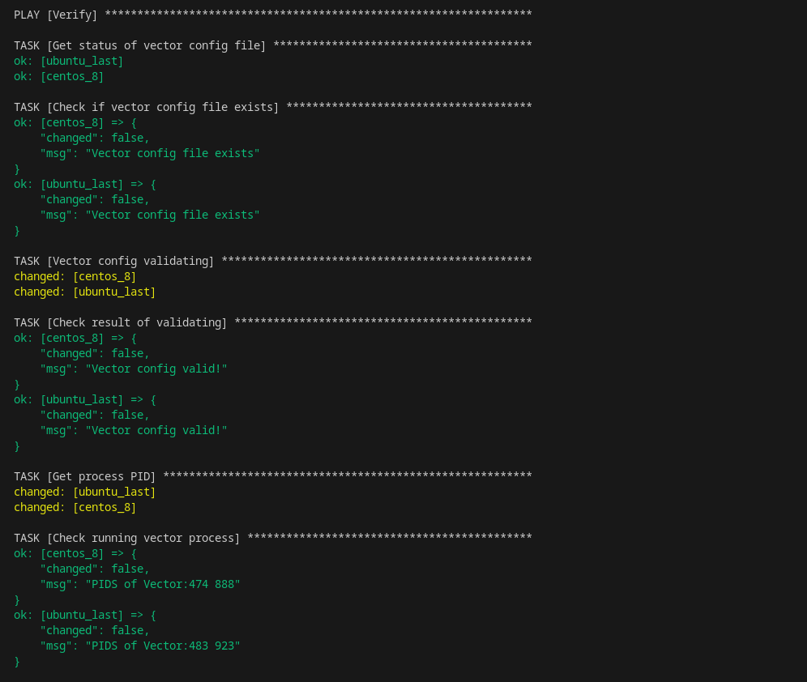
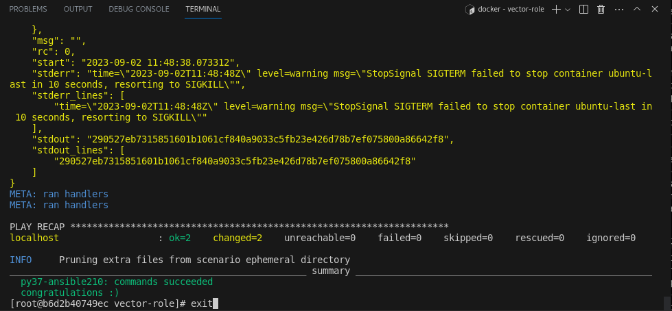
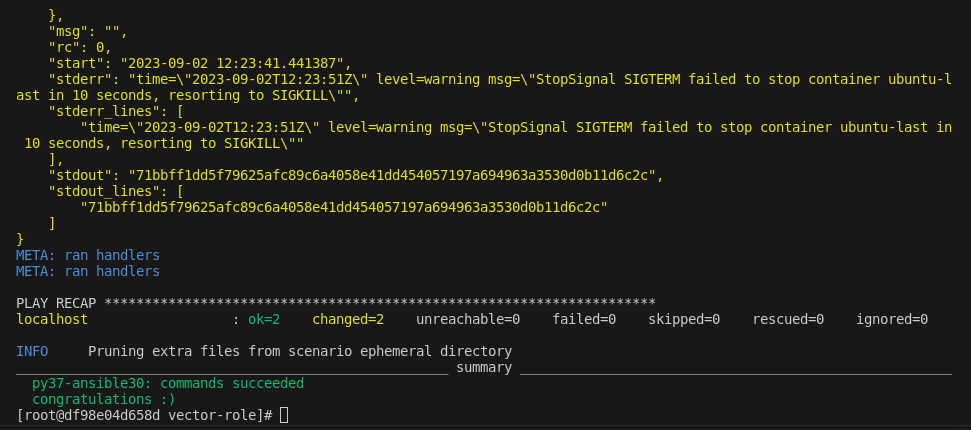

# Домашнеe заданиe по занятию "7.5 Тестирование roles"

## Скрины и логи выполнения команд по пунктам:

### 1. Molecule. Тестирование vector-role

Результат тестирования, этап verify:

[Лог тестирования vector-role](./applications/test_vector-role.log)

### 2. Tox. Тестирование vector-role

Результат тестирования tox (python 3.7, ansible 2.10):

Результат тестирования tox (python 3.7, ansible 3.0):

