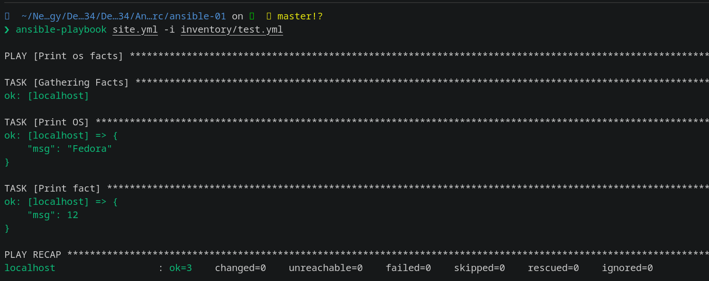
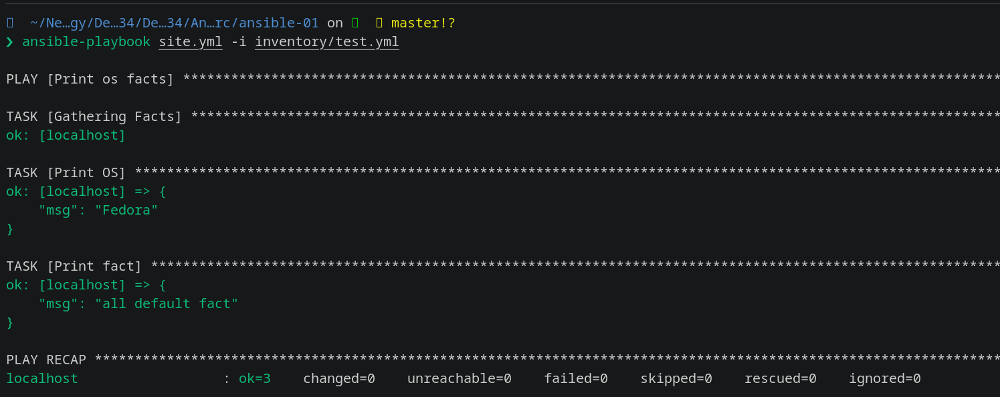
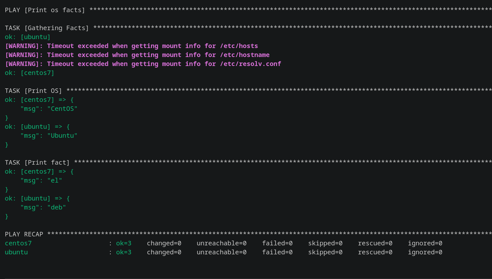
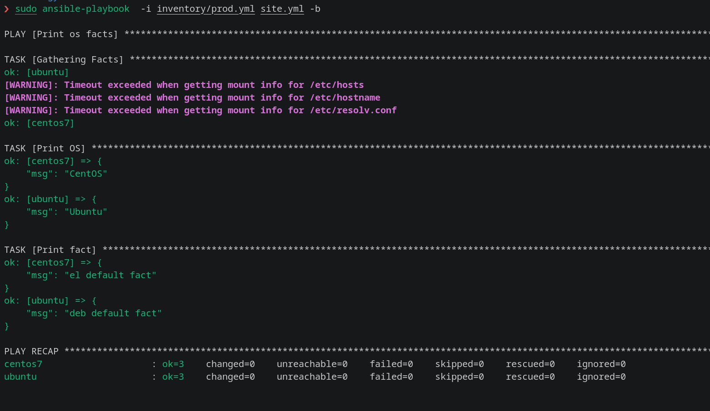
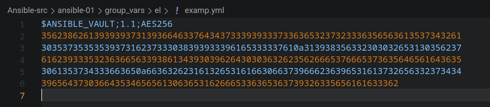
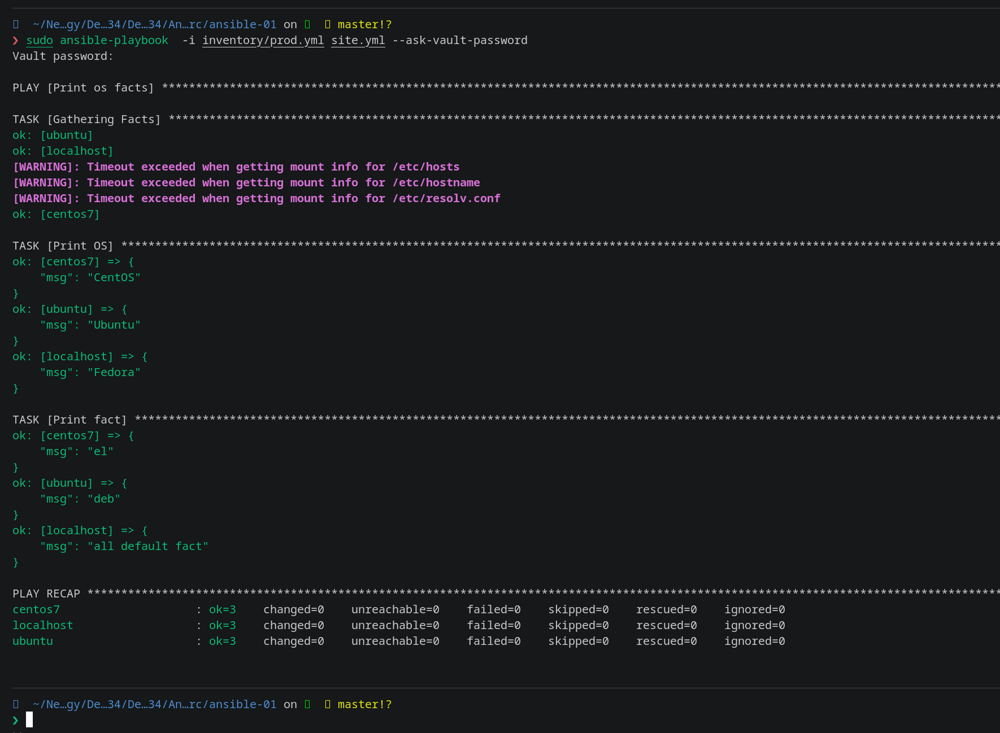

## Домашнее задание к занятию "08.01 Введение в Ansible"

Подготовка к выполнению
- Установите Ansible версии 2.10 или выше.
- Создайте свой публичный репозиторий на GitHub с произвольным именем.
- Скачайте Playbook из репозитория с домашним заданием и перенесите его в свой репозиторий.


### Основная часть
- Попробуйте запустить playbook на окружении из test.yml, зафиксируйте значение, которое имеет факт some_fact для указанного хоста при выполнении playbook.


- Найдите файл с переменными (group_vars), в котором задаётся найденное в первом пункте значение, и поменяйте его на all default fact.

``` vim /DevOps-34/Ansible-src/ansible-01/group_vars/all/examp.yml```
``` bash 
some_fact: all default fact
```


- Воспользуйтесь подготовленным (используется docker) или создайте собственное окружение для проведения дальнейших испытаний.
``` bash 
 docker run -dit --name centos7 pycontribs/centos:7                                                                                        

 docker run -dit --name ubuntu pycontribs/ubuntu:latest
```
``` bash docker ps                      

CONTAINER ID   IMAGE                      COMMAND           CREATED             STATUS             PORTS     NAMES
e0761bc1bd39   pycontribs/centos:7        "/bin/bash"       34 minutes ago      Up 34 minutes                centos7
4a099c333541   pycontribs/ubuntu:latest   "sleep 6000000"   About an hour ago   Up About an hour             ubuntu
```

- Проведите запуск playbook на окружении из prod.yml. Зафиксируйте полученные значения some_fact для каждого из managed host.


- Добавьте факты в group_vars каждой из групп хостов так, чтобы для some_fact получились значения: для deb — deb default fact, для el — el default fact.
```bash 
---
  some_fact: "el default fact"

--- 
  some_fact: "deb default fact"
```
- Повторите запуск playbook на окружении prod.yml. Убедитесь, что выдаются корректные значения для всех хостов.

- При помощи ansible-vault зашифруйте факты в group_vars/deb и group_vars/el с паролем netology.
``` bash 
 
❯ ansible-vault encrypt group_vars/deb/examp.yml 
New Vault password: 
Confirm New Vault password: 
Encryption successful

❯ ansible-vault encrypt group_vars/el/examp.yml 
New Vault password: 
Confirm New Vault password: 
Encryption successful

```


- Запустите playbook на окружении prod.yml. При запуске ansible должен запросить у вас пароль. Убедитесь в работоспособности.
``` bash
ansible-playbook  -i inventory/prod.yml site.yml --ask-vault-password
```

- Посмотрите при помощи ansible-doc список плагинов для подключения. Выберите подходящий для работы на control node.
``` bash 
ansible-doc -t connection -l  
```
- В prod.yml добавьте новую группу хостов с именем local, в ней разместите localhost с необходимым типом подключения.
``` bash 
local:
    hosts:
      localhost:
        ansible_connection: local
```
- Запустите playbook на окружении prod.yml. При запуске ansible должен запросить у вас пароль. Убедитесь, что факты some_fact для каждого из хостов определены из верных group_vars.

- Заполните README.md ответами на вопросы. Сделайте git push в ветку master. В ответе отправьте ссылку на ваш открытый репозиторий с изменённым playbook и заполненным README.md.

- Предоставьте скриншоты результатов запуска команд.

### Необязательная часть
- При помощи ansible-vault расшифруйте все зашифрованные файлы с переменными.
``` bash 
❯ ansible-vault decrypt group_vars/deb/examp.yml 
Vault password: 
Decryption successful

❯ ansible-vault decrypt group_vars/el/examp.yml 
Vault password: 
Decryption successful
```
- Зашифруйте отдельное значение PaSSw0rd для переменной some_fact паролем netology. Добавьте полученное значение в group_vars/all/exmp.yml.
- Запустите playbook, убедитесь, что для нужных хостов применился новый fact.


- Добавьте новую группу хостов fedora, самостоятельно придумайте для неё переменную. В качестве образа можно использовать этот вариант.
``` bash 
mkdir group_vars/fedora
vim  group_vars/fedora/examp.yml   

---
  some_fact: "some fedora facts" 
```

- Напишите скрипт на bash: автоматизируйте поднятие необходимых контейнеров, запуск ansible-playbook и остановку контейнеров.
``` bash 
#!/bin/bash
clear
name=("fedora" "centos7" "ubuntu" )
image=("pycontribs/fedora" "pycontribs/centos:7" "pycontribs/ubuntu:latest" )

for i in ${image[@]}; do
   case $i in
   pycontribs/fedora)
     docker run -dit --name ${name[0]} $i bash
     ;;
   pycontribs/centos:7)
     docker run -dit --name ${name[1]} $i bash
     ;;
   pycontribs/ubuntu:latest)
     docker run -dit --name ${name[2]} $i bash
     ;;
   esac
done
echo ""
echo "Контейнеры запущены"
sleep 5
echo ""
echo "Запускаем Ansible playbook"
sleep 5
ansible-playbook -i ./inventory/prod.yml site.yml

echo "Останавливаем контейнеры"
docker stop $(docker ps -q)
```


- Все изменения должны быть зафиксированы и отправлены в ваш личный репозиторий.

### Как оформить решение задания
- Выполненное домашнее задание пришлите в виде ссылки на .md-файл в вашем репозитории.


