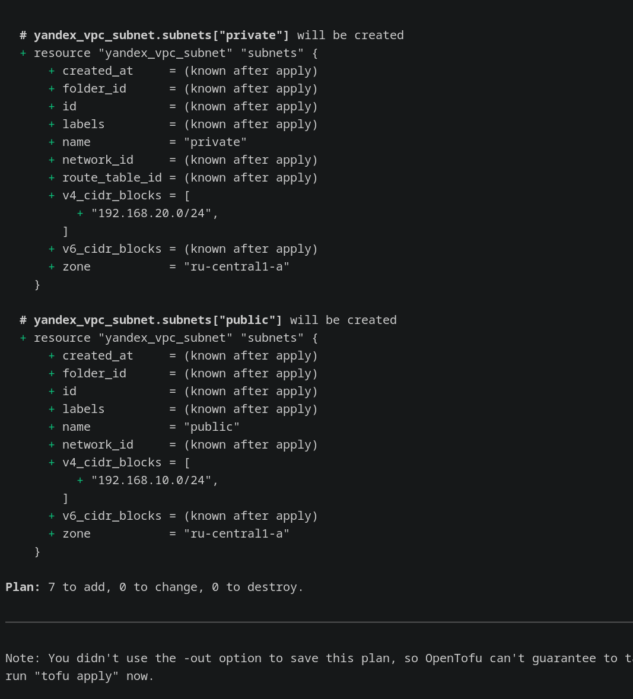
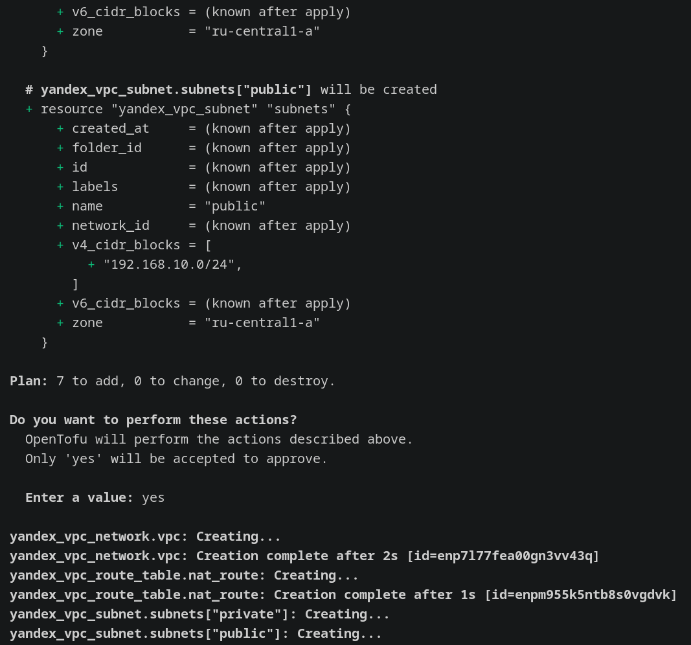
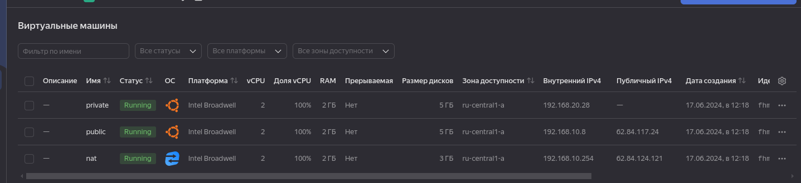
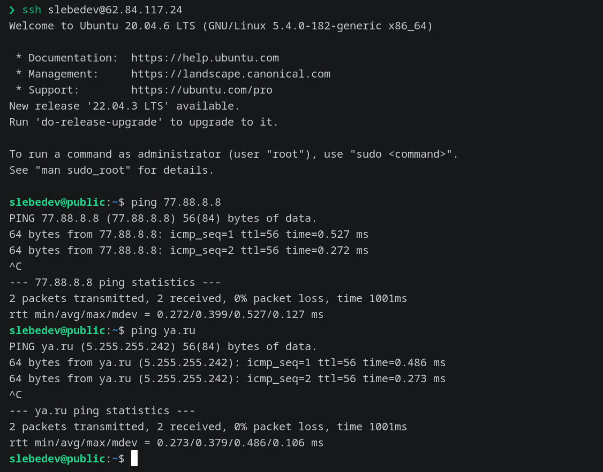
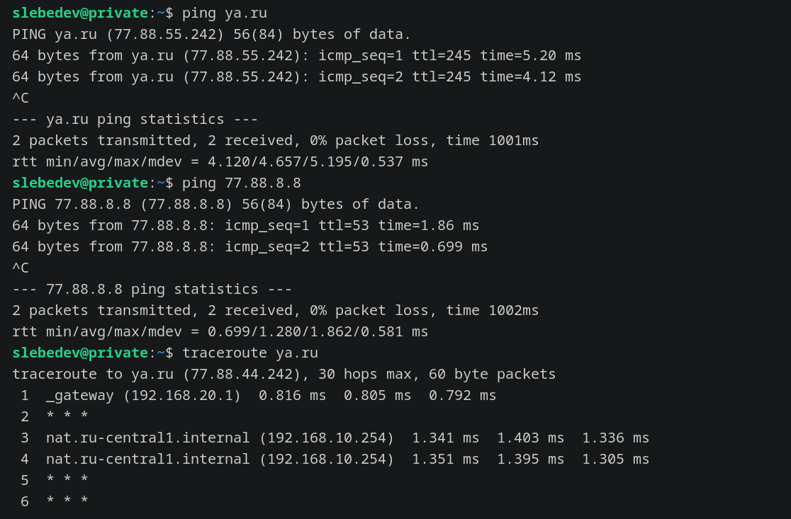

# Домашнее задание к занятию "15.1. Организация сети"

Домашнее задание будет состоять из обязательной части, которую необходимо выполнить на провайдере Яндекс.Облако и дополнительной части в AWS по желанию. Все домашние задания в 15 блоке связаны друг с другом и в конце представляют пример законченной инфраструктуры.  
Все задания требуется выполнить с помощью Terraform, результатом выполненного домашнего задания будет код в репозитории. 

Перед началом работ следует настроить доступ до облачных ресурсов из Terraform используя материалы прошлых лекций и [ДЗ](https://github.com/netology-code/virt-homeworks/tree/master/07-terraform-02-syntax ). А также заранее выбрать регион (в случае AWS) и зону.

---
## Задание 1. Яндекс.Облако (обязательное к выполнению)
> 
> 1. Создать VPC.
>
> - Создать пустую VPC. Выбрать зону.
>
> 2. Публичная подсеть.
>
> - Создать в vpc subnet с названием public, сетью 192.168.10.0/24.
> - Создать в этой подсети NAT-инстанс, присвоив ему адрес 192.168.10.254. В качестве image_id использовать fd80mrhj8fl2oe87o4e1
> - Создать в этой публичной подсети виртуалку с публичным IP и подключиться к ней, убедиться что есть доступ к интернету.
>
> 3. Приватная подсеть.
>
> - Создать в vpc subnet с названием private, сетью 192.168.20.0/24.
> - Создать route table. Добавить статический маршрут, направляющий весь исходящий трафик private сети в NAT-инстанс
> - Создать в этой приватной подсети виртуалку с внутренним IP, подключиться к ней через виртуалку, созданную ранее и убедиться что есть доступ к интернету
>
> Resource terraform для ЯО
>
> - [VPC subnet](https://registry.terraform.io/providers/yandex-cloud/yandex/latest/docs/resources/vpc_subnet)
> - [Route table](https://registry.terraform.io/providers/yandex-cloud/yandex/latest/docs/resources/vpc_route_table)
> - [Compute Instance](https://registry.terraform.io/providers/yandex-cloud/yandex/latest/docs/resources/compute_instance)
>
> ---

### Решение:

С помощью `OpenTofu` развернул все необходимые ресурсы в Yandex Cloud [Tofu/](Tofu)

- в [variables.tf](Tofu/variables.tf) объявлены переменные с параметрами для всех объектов, объединены в map-ы для удобства. Сами значения (только публичные) заданы в [public.auto.tfvars](Tofu/public.auto.tfvars).
Переменными настраиваются параметры ВМ и VPC, map key используется как имя создаваемого объекта.
- в [network.tf](Tofu/network.tf) описано создание `VPC` и `subnets`, а также `route table`
- в [.tf](Tofu/main.tf) описано создание шаблона `cloud-init`, получение `images` id и самих `Compute Instance` через for_each

Далее:  

- `tofu plan`
    
- `tofu apply`
    
- Результат выполнения команды в YC 
    `Apply complete! Resources: 7 added, 0 changed, 0 destroyed.`
    
- Подключение к public ВМ для проверки работоспособности сетевого подключения к сети Интернет:
    
- Подключение к рrivate ВМ для проверки работоспособности сетевого подключения к сети Интернет c проверкой работы `NAT`:
    