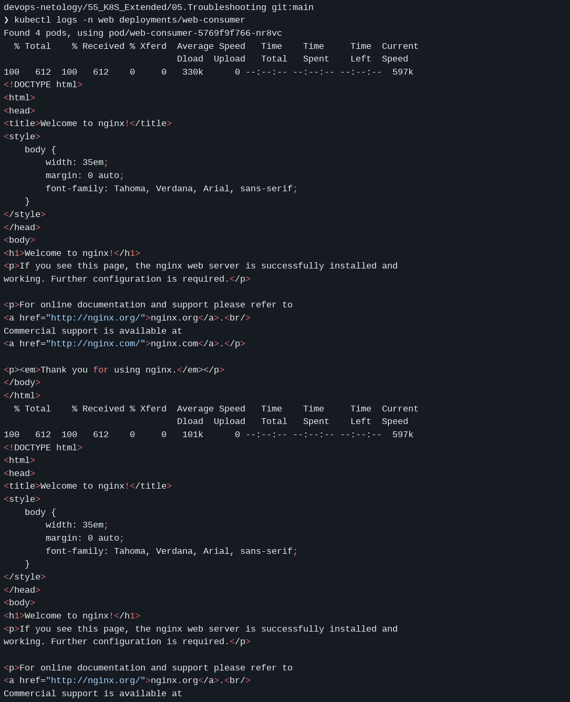

# Домашнее задание к занятию Troubleshooting

### Цель задания

Устранить неисправности при деплое приложения.

### Чеклист готовности к домашнему заданию

1. Кластер K8s.

### Задание. При деплое приложение web-consumer не может подключиться к auth-db. Необходимо это исправить

1. Установить приложение по команде:

```shell
kubectl apply -f https://raw.githubusercontent.com/netology-code/kuber-homeworks/main/3.5/files/task.yaml
```

2. Выявить проблему и описать.
3. Исправить проблему, описать, что сделано.
4. Продемонстрировать, что проблема решена.

### Ответ

1. Отсутствуют необходимые namespace:


```shell
devops-netology/55_K8S_Extended/05.Troubleshooting git:main  13s
❯ kubectl apply -f .                                  
Error from server (NotFound): error when creating "task.yaml": namespaces "web" not found
Error from server (NotFound): error when creating "task.yaml": namespaces "data" not found
Error from server (NotFound): error when creating "task.yaml": namespaces "data" not found
```

**Решение:**


```shell
devops-netology/55_K8S_Extended/05.Troubleshooting git:main  
❯ kubectl create namespace web
namespace/web created
                                                                                                                               
devops-netology/55_K8S_Extended/05.Troubleshooting git:main  
❯ kubectl create namespace data
namespace/data created
```


```shell
devops-netology/55_K8S_Extended/05.Troubleshooting git:main  
❯ kubectl get pods -A          
NAMESPACE     NAME                                       READY   STATUS    RESTARTS        AGE
kube-system   calico-kube-controllers-6f469498b4-j8jsh   1/1     Running   94 (25m ago)    13d
kube-system   calico-node-92d7r                          1/1     Running   85 (25m ago)    13d
kube-system   coredns-7745f9f87f-8zfjv                   1/1     Running   312 (25m ago)   62d
kube-system   metrics-server-7747f8d66b-vhnhv            1/1     Running   312 (25m ago)   62d
data          auth-db-864ff9854c-wtqmn                   1/1     Running   0               5m5s
web           web-consumer-5769f9f766-v4t47              1/1     Running   0               5m5s
web           web-consumer-5769f9f766-7gl2s              1/1     Running   0               5m5s
```

2. Web-consumer не может найти auth-db

```shell
devops-netology/55_K8S_Extended/05.Troubleshooting git:main  
❯ kubectl logs -n web deployments/web-consumer                 
Found 2 pods, using pod/web-consumer-84fc79d94d-5njwx
curl: (6) Couldn't resolve host 'auth-db'
curl: (6) Couldn't resolve host 'auth-db'
```

**Решение**

Так как сервис `auth-db` находится в другом пространстве имён, необходимо использовать полный FQDN ресурса, или как минимум указать на namespace:

```yaml
      containers:
      - command:
        - sh
        - -c
        - while true; do curl auth-db.data.svc.cluster.local; sleep 5; done # либо просто auth-db.data
        image: radial/busyboxplus:curl
        name: busybox
---
```

После пересоздания с обновлёнными параметрами:



```shell
devops-netology/55_K8S_Extended/05.Troubleshooting git:main  
❯ kubectl logs -n web deployments/web-consumer 
Found 4 pods, using pod/web-consumer-5769f9f766-nr8vc
  % Total    % Received % Xferd  Average Speed   Time    Time     Time  Current
                                 Dload  Upload   Total   Spent    Left  Speed
100   612  100   612    0     0   330k      0 --:--:-- --:--:-- --:--:--  597k
<!DOCTYPE html>
<html>
<head>
<title>Welcome to nginx!</title>
<style>
    body {
        width: 35em;
        margin: 0 auto;
        font-family: Tahoma, Verdana, Arial, sans-serif;
    }
</style>
</head>
<body>
<h1>Welcome to nginx!</h1>
<p>If you see this page, the nginx web server is successfully installed and
working. Further configuration is required.</p>

<p>For online documentation and support please refer to
<a href="http://nginx.org/">nginx.org</a>.<br/>
Commercial support is available at
<a href="http://nginx.com/">nginx.com</a>.</p>

<p><em>Thank you for using nginx.</em></p>
</body>
</html>
  % Total    % Received % Xferd  Average Speed   Time    Time     Time  Current
                                 Dload  Upload   Total   Spent    Left  Speed
100   612  100   612    0     0   101k      0 --:--:-- --:--:-- --:--:--  597k
<!DOCTYPE html>
<html>
<head>
<title>Welcome to nginx!</title>
<style>
    body {
        width: 35em;
        margin: 0 auto;
        font-family: Tahoma, Verdana, Arial, sans-serif;
    }
</style>
</head>
<body>
<h1>Welcome to nginx!</h1>
<p>If you see this page, the nginx web server is successfully installed and
working. Further configuration is required.</p>

<p>For online documentation and support please refer to
<a href="http://nginx.org/">nginx.org</a>.<br/>
Commercial support is available at
<a href="http://nginx.com/">nginx.com</a>.</p>

<p><em>Thank you for using nginx.</em></p>
</body>
</html>
```

```shell
devops-netology/55_K8S_Extended/05.Troubleshooting git:main  
❯ kubectl logs -n data auth-db-864ff9854c-wtqmn 
/docker-entrypoint.sh: /docker-entrypoint.d/ is not empty, will attempt to perform configuration
/docker-entrypoint.sh: Looking for shell scripts in /docker-entrypoint.d/
/docker-entrypoint.sh: Launching /docker-entrypoint.d/10-listen-on-ipv6-by-default.sh
10-listen-on-ipv6-by-default.sh: Getting the checksum of /etc/nginx/conf.d/default.conf
10-listen-on-ipv6-by-default.sh: Enabled listen on IPv6 in /etc/nginx/conf.d/default.conf
/docker-entrypoint.sh: Launching /docker-entrypoint.d/20-envsubst-on-templates.sh
/docker-entrypoint.sh: Configuration complete; ready for start up
10.1.125.252 - - [16/Aug/2023:23:22:14 +0000] "GET / HTTP/1.1" 200 612 "-" "curl/7.35.0" "-"
10.1.125.249 - - [16/Aug/2023:23:22:16 +0000] "GET / HTTP/1.1" 200 612 "-" "curl/7.35.0" "-"
10.1.125.239 - - [16/Aug/2023:23:22:18 +0000] "GET / HTTP/1.1" 200 612 "-" "curl/7.35.0" "-"
10.1.125.195 - - [16/Aug/2023:23:22:18 +0000] "GET / HTTP/1.1" 200 612 "-" "curl/7.35.0" "-"
...
```