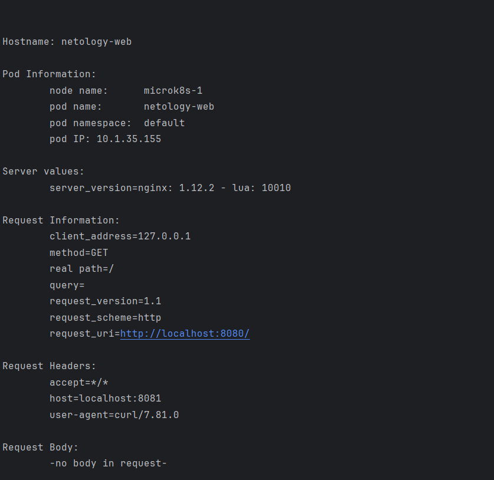
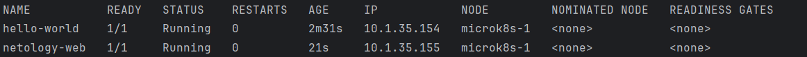

# Домашнее задание к занятию «Базовые объекты K8S»

### Цель задания

В тестовой среде для работы с Kubernetes, установленной в предыдущем ДЗ, необходимо развернуть Pod с приложением и подключиться к нему со своего локального компьютера. 

------

### Чеклист готовности к домашнему заданию

1. Установленное k8s-решение (например, MicroK8S).
2. Установленный локальный kubectl.
3. Редактор YAML-файлов с подключенным Git-репозиторием.

------

### Инструменты и дополнительные материалы, которые пригодятся для выполнения задания

1. Описание [Pod](https://kubernetes.io/docs/concepts/workloads/pods/) и примеры манифестов.
2. Описание [Service](https://kubernetes.io/docs/concepts/services-networking/service/).

------

### Задание 1. Создать Pod с именем hello-world

1. Создать манифест (yaml-конфигурацию) Pod.
2. Использовать image - gcr.io/kubernetes-e2e-test-images/echoserver:2.2.
3. Подключиться локально к Pod с помощью `kubectl port-forward` и вывести значение (curl или в браузере).

------
[demo pod](demo_pod.yml)

```yaml
$ kubectl apply -f demo_pod.yaml                               
pod/hello-world created

$ kubectl port-forward pods/hello-world 30080:8080                                                                                           
Forwarding from 127.0.0.1:30080 -> 8080
Forwarding from [::1]:30080 -> 8080
Handling connection for 30080
```

```bash
curl localhost:30080                                                     

Hostname: hello-world

Pod Information:
	-no pod information available-
Server values:
	server_version=nginx: 1.12.2 - lua: 10010
Request Information:
	client_address=127.0.0.1
	method=GET
	real path=/
	query=
	request_version=1.1
	request_scheme=http
	request_uri=http://localhost:8080/

Request Headers:
	accept=*/*  
	host=localhost:30080  
	user-agent=curl/7.81.0  

Request Body:
	-no body in request-

```

```bash
kubectl get pods                                                                                  
NAME          READY   STATUS    RESTARTS   AGE
hello-world   1/1     Running   0          6m7s
```


### Задание 2. Создать Service и подключить его к Pod

1. Создать Pod с именем netology-web.
2. Использовать image — gcr.io/kubernetes-e2e-test-images/echoserver:2.2.
3. Создать Service с именем netology-svc и подключить к netology-web.
4. Подключиться локально к Service с помощью `kubectl port-forward` и вывести значение (curl или в браузере).

------

[Netology-Web](netology-web.yaml)

```bash
$ kubectl apply -f netology-web.yaml                         
pod/netology-web created
service/netology-svc created

$ kubectl port-forward svc/netology-svc 9080:9080  
Forwarding from 127.0.0.1:9080 -> 8080
Forwarding from [::1]:9080 -> 8080
Handling connection for 9080

```

```bash
$ curl localhost:9080


Hostname: netology-web

Pod Information:
	-no pod information available-

Server values:
	server_version=nginx: 1.12.2 - lua: 10010

Request Information:
	client_address=127.0.0.1
	method=GET
	real path=/
	query=
	request_version=1.1
	request_scheme=http
	request_uri=http://localhost:8080/

Request Headers:
	accept=*/*  
	host=localhost:9080  
	user-agent=curl/7.81.0  

Request Body:
	-no body in request-
```


```bash
$ kubectl get pods                                                                                          
NAME           READY   STATUS    RESTARTS   AGE
netology-web   1/1     Running   0          7m19s
hello-world    1/1     Running   0          4m43s
```



```bash
$ kubectl describe svc netology-web                                                                                
Name:              netology-web
Namespace:         default
Labels:            <none>
Annotations:       <none>
Selector:          app=web
Type:              ClusterIP
IP Family Policy:  SingleStack
IP Families:       IPv4
IP:                10.152.183.254
IPs:               10.152.183.254
Port:              <unset>  9080/TCP
TargetPort:        8080/TCP
Endpoints:         10.1.125.255:8080
Session Affinity:  None
Events:            <none>

$ kubectl exec -it hello-world -- /bin/sh 

/ # ping 10.1.125.255
PING 10.1.125.255 (10.1.125.255): 56 data bytes
64 bytes from 10.1.125.255: seq=0 ttl=63 time=0.287 ms
64 bytes from 10.1.125.255: seq=1 ttl=63 time=0.175 ms
64 bytes from 10.1.125.255: seq=2 ttl=63 time=0.175 ms
```

### Правила приёма работы

1. Домашняя работа оформляется в своем Git-репозитории в файле README.md. Выполненное домашнее задание пришлите ссылкой на .md-файл в вашем репозитории.
2. Файл README.md должен содержать скриншоты вывода команд `kubectl get pods`, а также скриншот результата подключения.
3. Репозиторий должен содержать файлы манифестов и ссылки на них в файле README.md.

------

### Критерии оценки
Зачёт — выполнены все задания, ответы даны в развернутой форме, приложены соответствующие скриншоты и файлы проекта, в выполненных заданиях нет противоречий и нарушения логики.

На доработку — задание выполнено частично или не выполнено, в логике выполнения заданий есть противоречия, существенные недостатки.