## Цели задания

- Установить и настроить Terrafrom.
- Научиться использовать готовый код.

### Чек-лист готовности к домашнему заданию

- Скачайте и установите актуальную версию Terraform >=1.4.X . Приложите скриншот вывода команды terraform --version.
- Скачайте на свой ПК этот git-репозиторий. Исходный код для выполнения задания расположен в директории 01/src.
- Убедитесь, что в вашей ОС установлен docker.
- Зарегистрируйте аккаунт на сайте https://hub.docker.com/, выполните команду docker login и введите логин, пароль.

### Инструменты и дополнительные материалы, которые пригодятся для выполнения задания

    Репозиторий с ссылкой на зеркало для установки и настройки Terraform: ссылка.
    Установка docker: ссылка.

## Задание 1

- Перейдите в каталог src. Скачайте все необходимые зависимости, использованные в проекте.
- Изучите файл .gitignore. В каком terraform-файле, согласно этому .gitignore, допустимо сохранить личную, секретную информацию?
- Выполните код проекта. Найдите в state-файле секретное содержимое созданного ресурса random_password, пришлите в качестве ответа конкретный ключ и его значение.
- Раскомментируйте блок кода, примерно расположенный на строчках 29–42 файла main.tf. Выполните команду terraform validate. Объясните, в чём заключаются намеренно допущенные ошибки. Исправьте их.
- Выполните код. В качестве ответа приложите: исправленный фрагмент кода и вывод команды   ```docker ps```.
- Замените имя docker-контейнера в блоке кода на hello_world. Не перепутайте имя контейнера и имя образа. Мы всё ещё продолжаем использовать name = "nginx:latest". Выполните команду terraform apply -auto-approve. Объясните своими словами, в чём может быть опасность применения ключа -auto-approve. В качестве ответа дополнительно приложите вывод команды docker ps.
- Уничтожьте созданные ресурсы с помощью terraform. Убедитесь, что все ресурсы удалены. Приложите содержимое файла terraform.tfstate.
- Объясните, почему при этом не был удалён docker-образ nginx:latest. Ответ обязательно подкрепите строчкой из документации terraform провайдера docker. (ищите в классификаторе resource docker_image )

### Дополнительное задание (со звёздочкой*)

<i><b> Настоятельно рекомендуем выполнять все задания со звёздочкой. Они помогут глубже разобраться в материале.
Задания со звёздочкой дополнительные, не обязательные к выполнению и никак не повлияют на получение вами зачёта по этому домашнему заданию. </i></b>
## Задание 2*

- Изучите в документации provider Virtualbox от shekeriev.
- Создайте с его помощью любую виртуальную машину. Чтобы не использовать VPN, советуем выбрать любой образ с расположением в GitHub из списка.

В качестве ответа приложите plan для создаваемого ресурса и скриншот созданного в VB ресурса.


####  Правила приёма работы

Домашняя работа оформляется в отдельном GitHub-репозитории в файле README.md.
Выполненное домашнее задание пришлите ссылкой на .md-файл в вашем репозитории.
Критерии оценки

<b>Зачёт ставится, если: </b>

- [x]     выполнены все задания,
- [x]     ответы даны в развёрнутой форме,
- [x]     приложены соответствующие скриншоты и файлы проекта,
- [x]     в выполненных заданиях нет противоречий и нарушения логики.

<b>На доработку работу отправят, если: </b>

* задание выполнено частично или не выполнено вообще,
* в логике выполнения заданий есть противоречия и существенные недостатки.

 _________________________________________________________


## Решение 1: 
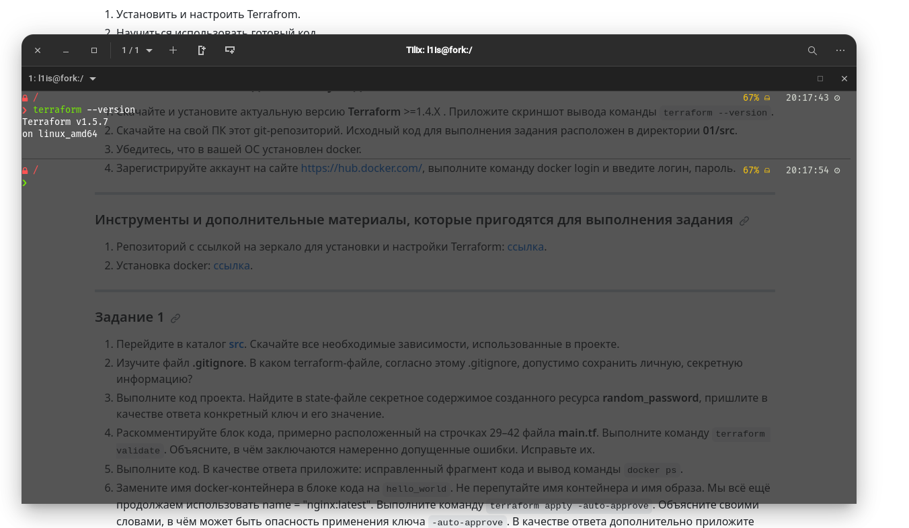
 _________________________________________________________
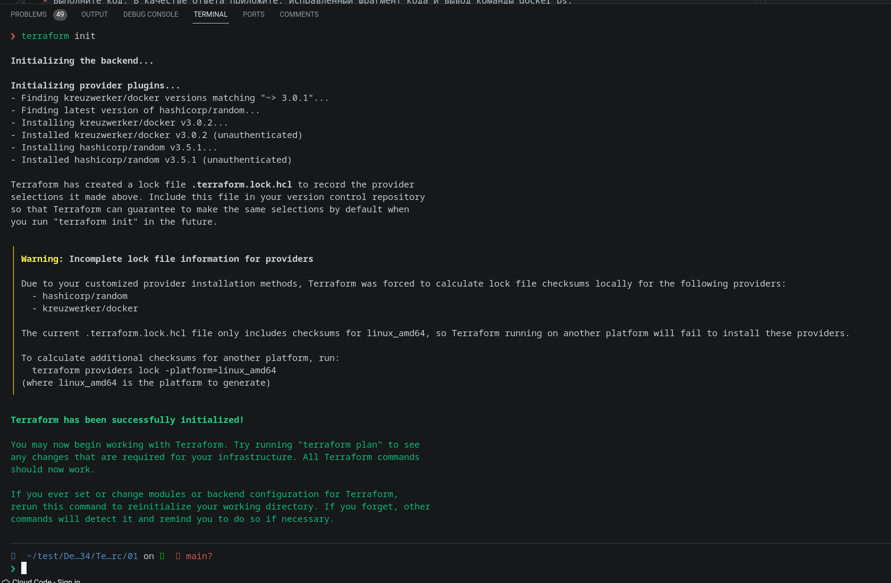
 _________________________________________________________
Персональные данные, согласно файлу ```.gitignore``` может хранить тут:
```
# own secret vars store.
personal.auto.tfvars 
```
 _________________________________________________________
 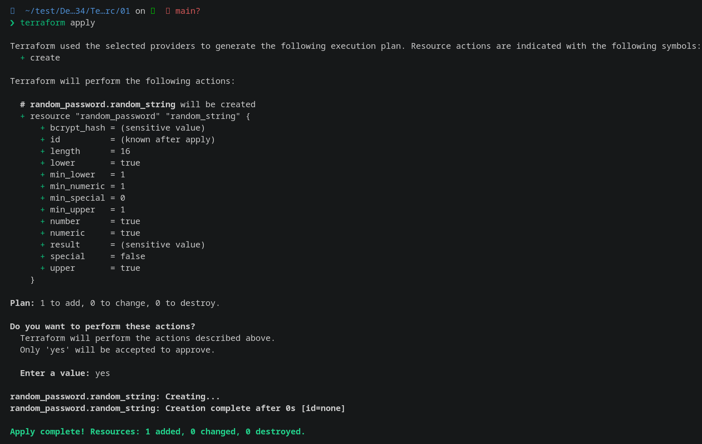
 ``` "result": "2q3mdBlGjGIxXitC" ```

 _________________________________________________________
После того как мы расскоментрировали строки в файле ```main.tf ```, при выполнении команды ```terraform validate``` наблюдается ошибка: 
``` bash
Error: Missing name for resource
│ 
│   on main.tf line 24, in resource "docker_image":
│   24: resource "docker_image" {
│ 
│ All resource blocks must have 2 labels (type, name).
╵
╷
│ Error: Invalid resource name
│ 
│   on main.tf line 29, in resource "docker_container" "1nginx":
│   29: resource "docker_container" "1nginx" {
│ 
│ A name must start with a letter or underscore and may contain only letters, digits, underscores, and dashes.
```
Которая говорит нам о том, что: 
 - Блок ресурса должен иметь 2 значения тип и имя, в примере указано одно значение из-за чего возникает ошибка. Пример из файла ```main.tf``` 
 Должно быть так: ```resource "random_password" "random_string" {```   
 А у нас, до исправления ошибки, так: ``` resource "docker_image" { ```
 - имя не может начинаться с цифры, но межет начинаться с (_) или буквы. В нашем коде, на момент до исправления ошибки, написано так: ``` resource "docker_container" "1nginx" { ```

Исправленный код выглядит следующим образом: 
``` bash
resource "docker_image" "nginx" {
  name         = "nginx:latest"
  keep_locally = true
}

resource "docker_container" "nginx" {
  image = docker_image.nginx.image_id
  name  = "example_${random_password.random_string_FAKE.resulT}"
```
 _________________________________________________________

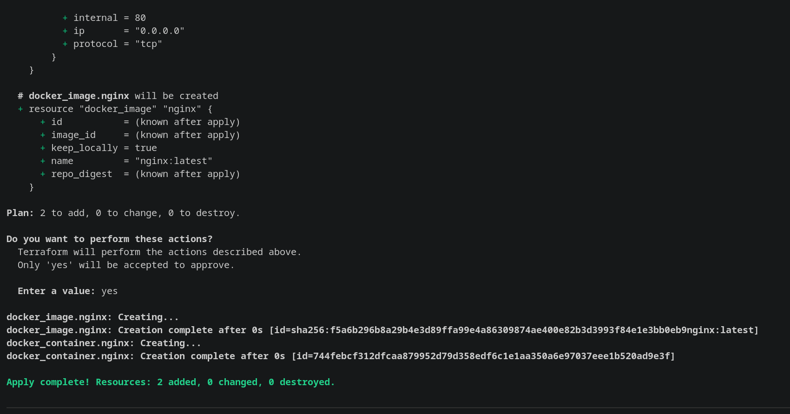

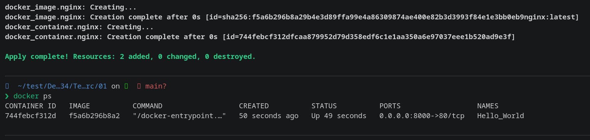
 _________________________________________________________
Выполнил команду ```terraform apply -auto-approve``` Вывод команды ```docker ps```
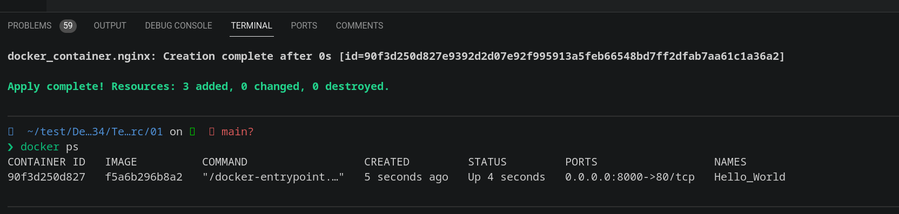
Выявленная экперементальным путем опасность, на мой взляд, заключается в применение инфраструктуры, описанной в коде Terraform, без запроса подтверждения пользователя. 

На мой взгляд есть несколько опасностей, связанных с использованием ``` terraform apply -auto-approve```:

- Непредсказуемые изменения: Если в коде Terraform есть ошибки или нежелательные изменения, команда ```terraform apply -auto-approve``` применит эти изменения без предупреждения или возможности проверки. Это может привести к непредсказуемым результатам и нарушению работы вашей инфраструктуры.

- Потеря данных: Если в коде Terraform есть ошибки или неправильные настройки, команда ```terraform apply -auto-approve``` может привести к потере данных или некорректной конфигурации. Без возможности проверить изменения перед их применением, есть риск потерять важные данные или нарушить работу инфраструктуры.

- Непреднамеренные затраты: Если  код Terraform создает или изменяет ресурсы, которые требуют платы (например, виртуальные машины в облаке), команда ```terraform apply -auto-approve``` может привести к непреднамеренным затратам на наш счет.


Чтобы избежать этих опасностей, рекомендуется всегда внимательно проверять код Terraform перед его применением и использовать команду ``` terraform plan```, чтобы увидеть предполагаемые изменения перед их фактическим применением.

 _________________________________________________________
Выполянем команду ```terraform destroy```
 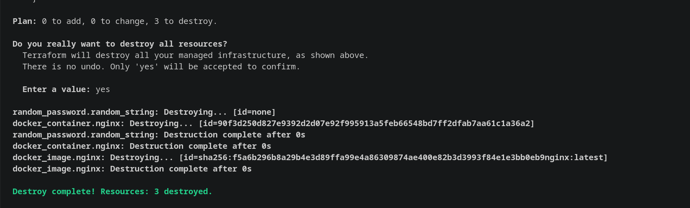
 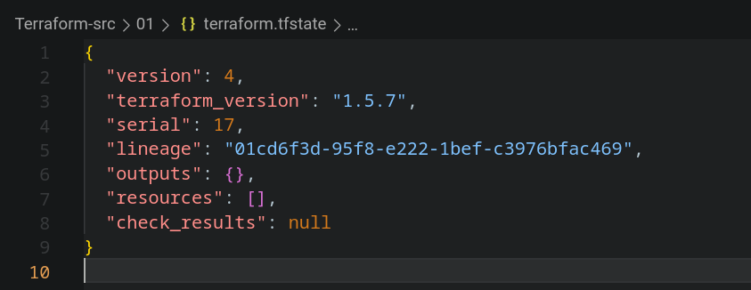

 Команда ```terraform destroy``` в Terraform используется для удаления созданных ресурсов. Однако, по умолчанию, она не удаляет docker-образы, в нашем примере ```nginx:latest```, поскольку Terraform не управляет непосредственно docker-образами.

В документации провайдера Terraform для Docker (https://registry.terraform.io/providers/kreuzwerker/docker/latest/docs/resources/image), можно найти следующую строку:


``` "This resource does not manage the lifecycle of the image. It is up to the user to pull, build, and push images as necessary."```


Это означает, что ресурс docker_image в Terraform не управляет жизненным циклом образа. Пользователю самостоятельно необходимо загружать (pull), собирать (build) и публиковать (push) образы по необходимости.

Таким образом, при выполнении команды ```terraform destroy```, Terraform будет удалять только те ресурсы, которые были созданы и управляются Terraform, но не будет удалять docker-образы.

Если требуется удалить docker-образ ```nginx:latest```, нужно воспользоваться командой Docker CLI, например:

``` docker rmi nginx:latest```

<b><i> Комментарий преподователя: Задание про удаление образа не верно. В коде указан параметр который не разрешает терраформу удалить образ контейнера. Нужно его указать.</b></i>

Согласно нашему коду, Docker образ не был удален из-за строчки: ``` keep_locally = true ```. 
Базовый блок кода выглядит следующим образом
``` bash 
resource "docker_image" "nginx" {
  name         = "nginx:latest"
}
```

А в нашем коде: 
``` bash
resource "docker_image" "nginx" {
  name         = "nginx:latest"
  keep_locally = true
}
```

## Решение 2*
Сперва написал файд ```main.tf``` с описанием виртуальной машины создаваемой на VitrualBox, далее выполнил команду: ``` terraform init```
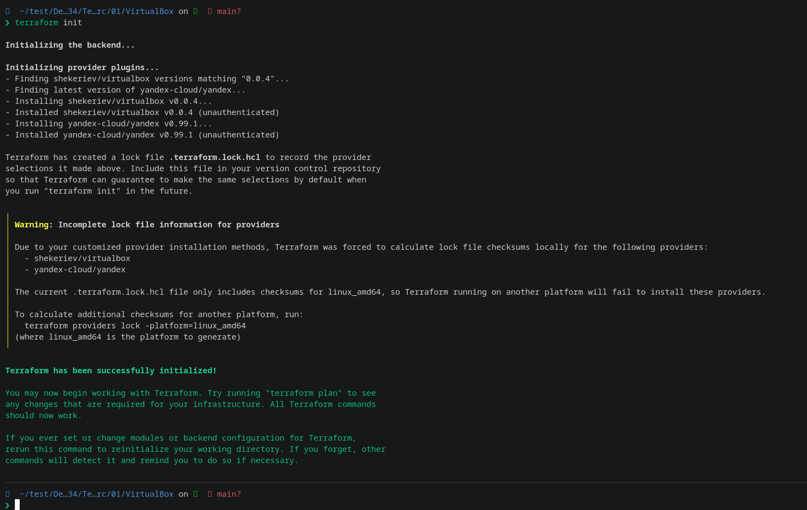

```terrafrom plan```
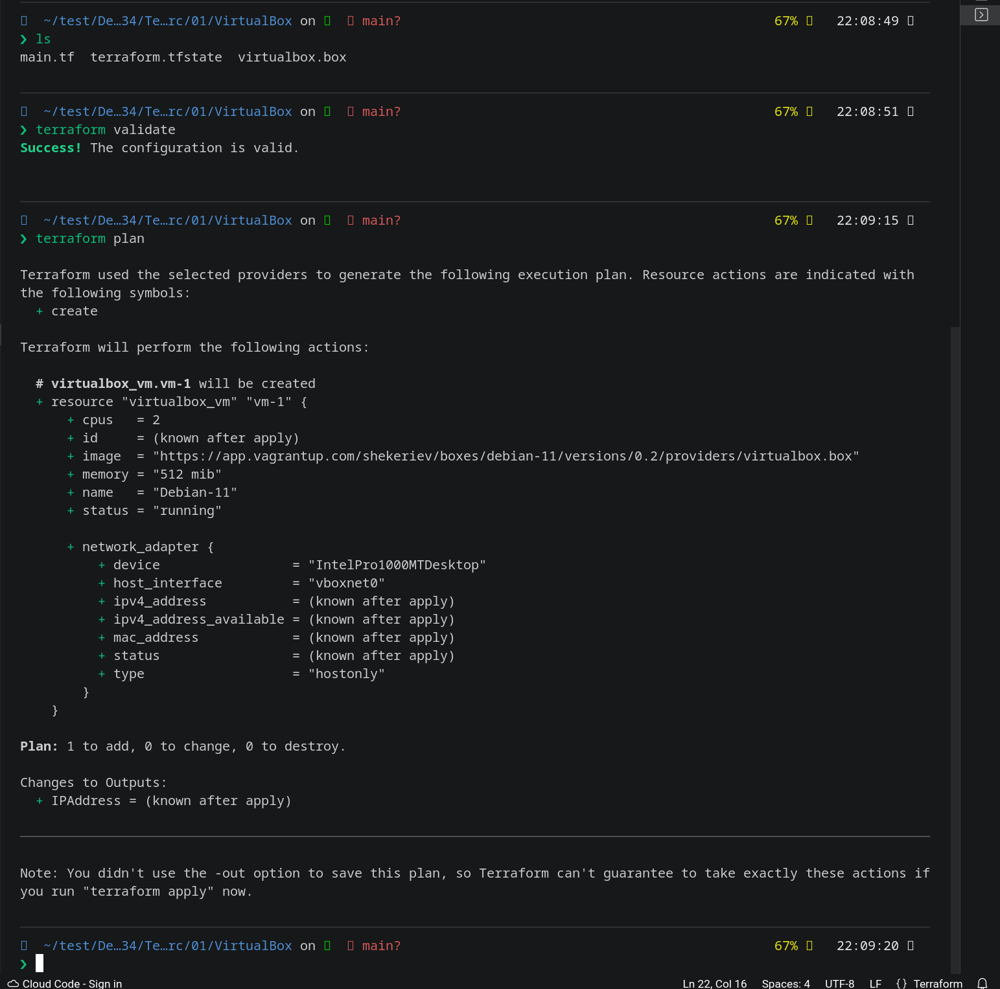
```terraform apply```
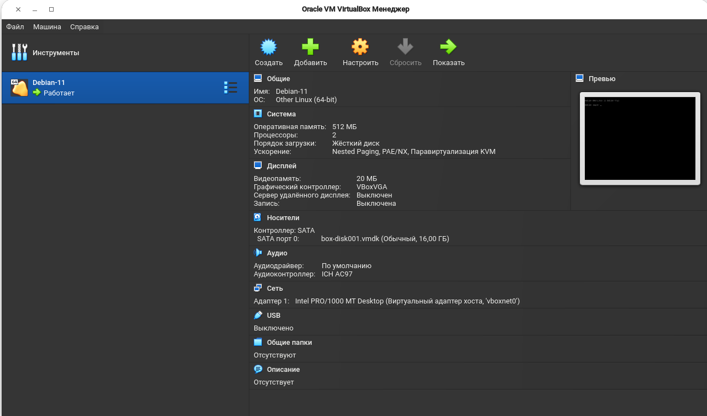