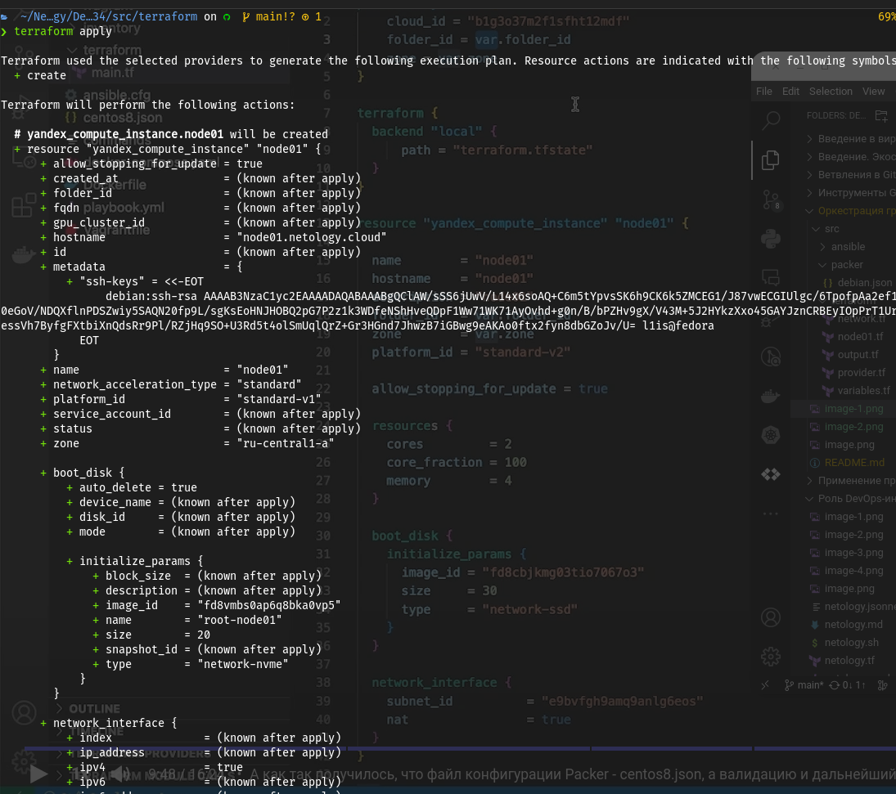
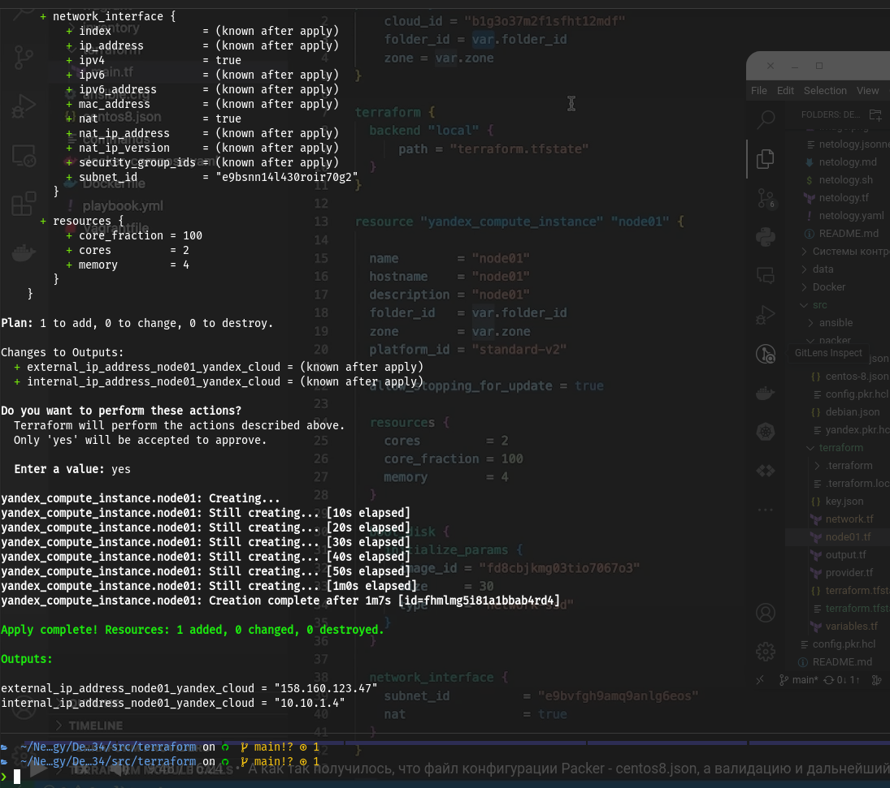
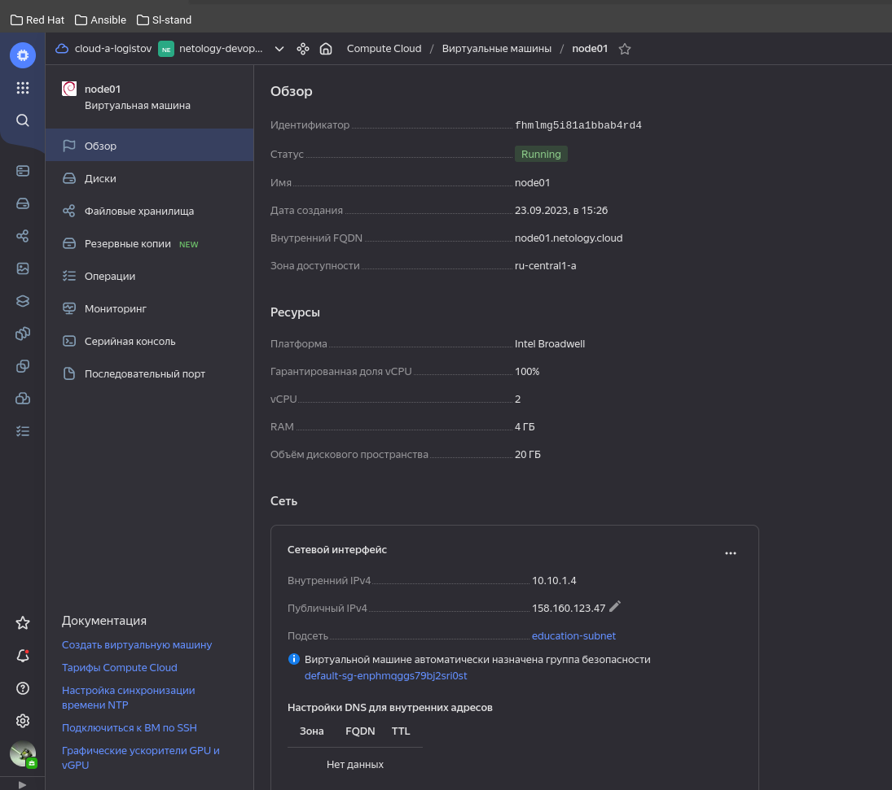
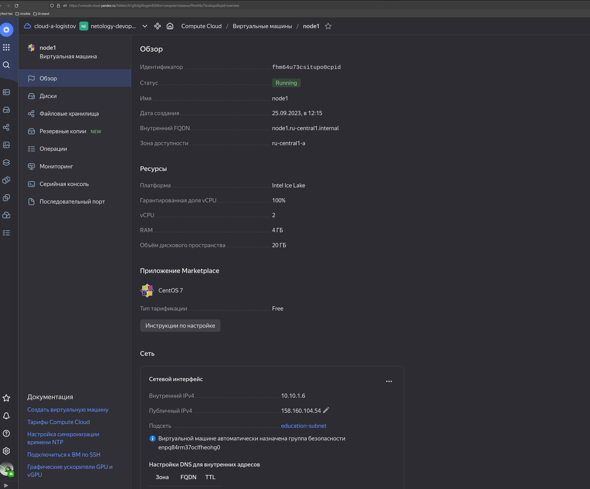
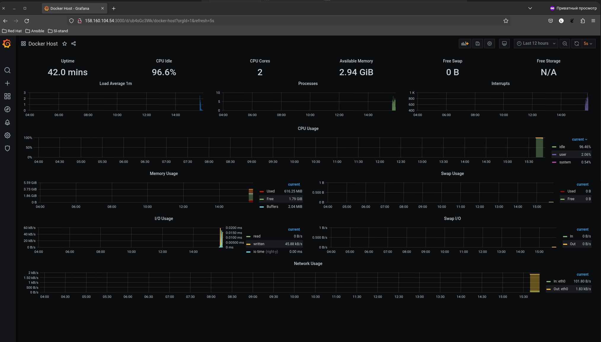

### Как сдавать задания
Обязательны к выполнению задачи без звёздочки. Их нужно выполнить, чтобы получить зачёт и диплом о профессиональной переподготовке.

Задачи со звёздочкой (*) — это дополнительные задачи и/или задачи повышенной сложности. Их выполнять не обязательно, но они помогут вам глубже понять тему.

Домашнее задание выполните в файле readme.md в GitHub-репозитории. В личном кабинете отправьте на проверку ссылку на .md-файл в вашем репозитории.

Любые вопросы по решению задач задавайте в чате учебной группы.

### Важно
Перед отправкой работы на проверку удаляйте неиспользуемые ресурсы. Это нужно, чтобы не расходовать средства, полученные в результате использования промокода.

Подробные рекомендации здесь. 
_________________________________________________________
## Задача 1
- Создайте собственный образ любой операционной системы (например, debian-11) с помощью Packer (инструкция для установки плагина yandex-cloud). 
https://cloud.yandex.ru/docs/tutorials/infrastructure-management/packer-quickstart

<i>Чтобы получить зачёт, вам нужно предоставить скриншот страницы с созданным образом из личного кабинета YandexCloud. </i>
_________________________________________________________
## Задача 2
- 2.1. Создайте вашу первую виртуальную машину в YandexCloud с помощью web-интерфейса YandexCloud.

- 2.2.* (Необязательное задание)
Создайте вашу первую виртуальную машину в YandexCloud с помощью Terraform (вместо использования веб-интерфейса YandexCloud). Используйте Terraform-код в директории (src/terraform).

<i> Чтобы получить зачёт, вам нужно предоставить вывод команды terraform apply и страницы свойств, созданной ВМ из личного кабинета YandexCloud. </i>
_________________________________________________________
## Задача 3
- С помощью Ansible и Docker Compose разверните на виртуальной машине из предыдущего задания систему мониторинга на основе Prometheus/Grafana. Используйте Ansible-код в директории (src/ansible).

<i>Чтобы получить зачёт, вам нужно предоставить вывод команды "docker ps" , все контейнеры, описанные в docker-compose, должны быть в статусе "Up". </i>
________________________________________________________
## Задача 4
- Откройте веб-браузер, зайдите на страницу http://<внешний_ip_адрес_вашей_ВМ>:3000.
- Используйте для авторизации логин и пароль из .env-file.
- Изучите доступный интерфейс, найдите в интерфейсе автоматически созданные docker-compose-панели с графиками(dashboards).
- Подождите 5-10 минут, чтобы система мониторинга успела накопить данные.
<i>Чтобы получить зачёт, предоставьтескриншот работающего веб-интерфейса Grafana с текущими метриками, как на примере ниже.</i>
_________________________________________________________
## Задача 5 (*)
- Создайте вторую ВМ и подключите её к мониторингу, развёрнутому на первом сервере.

<i>Чтобы получить зачёт, предоставьте скриншот из Grafana, на котором будут отображаться метрики добавленного вами сервера. </i>

_________________________________________________________
## Решение 1.

## Решение 2.

## Решение 3.

## Решение 4
