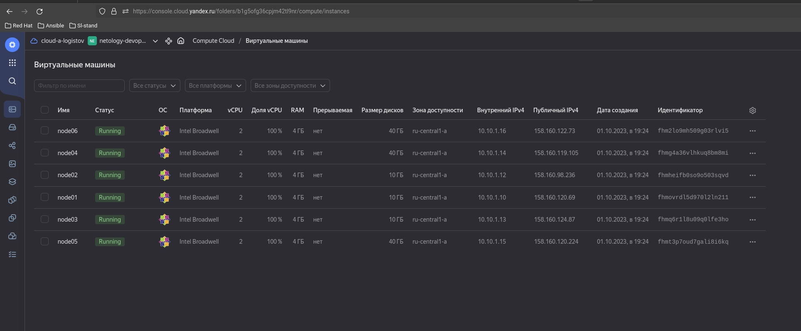
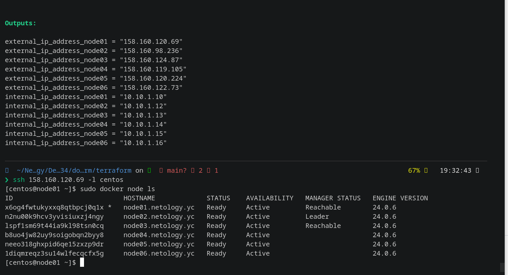
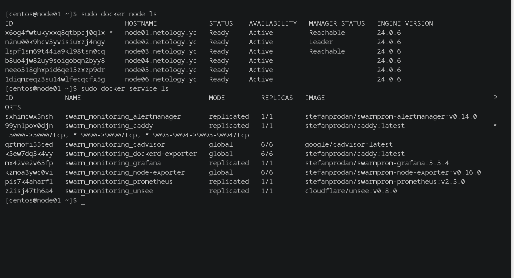

## Задача 1

Дайте письменые ответы на вопросы:

    В чём отличие режимов работы сервисов в Docker Swarm-кластере: replication и global?
    Какой алгоритм выбора лидера используется в Docker Swarm-кластере?
    Что такое Overlay Network?

## Задача 2

Создайте ваш первый Docker Swarm-кластер в Яндекс Облаке.

Чтобы получить зачёт, предоставьте скриншот из терминала (консоли) с выводом команды:

``` docker node ls```

## Задача 3

Создайте ваш первый, готовый к боевой эксплуатации кластер мониторинга, состоящий из стека микросервисов.

Чтобы получить зачёт, предоставьте скриншот из терминала (консоли), с выводом команды:

``` docker service ls```

## Задача 4 (*)

Выполните на лидере Docker Swarm-кластера команду, указанную ниже, и дайте письменное описание её функционала — что она делает и зачем нужна:

#### см.документацию: https://docs.docker.com/engine/swarm/swarm_manager_locking/
```docker swarm update --autolock=true```
________________________________________________________
## Решение 1.
Режим replication в Docker Swarm-кластере означает, что сервис будет запущен на нескольких узлах (replicas) в кластере. Количество реплик задается при создании сервиса и может быть изменено позже с помощью команды ```docker service update```. Каждая реплика сервиса будет работать независимо друг от друга, и Docker Swarm будет автоматически балансировать нагрузку между ними.

Режим global в Docker Swarm-кластере означает, что сервис будет запущен на каждом узле в кластере. В этом режиме количество реплик не указывается, и Docker Swarm автоматически запускает сервис на каждом доступном узле. Это полезно, когда требуется запустить сервис на каждом узле для обеспечения высокой доступности или для выполнения задач, которые требуют наличия сервиса на каждом узле.

Алгоритм выбора лидера в Docker Swarm-кластере

В Docker Swarm-кластере используется алгоритм выбора лидера, называемый Raft. Raft - это алгоритм консенсуса, который обеспечивает надежное и согласованное состояние кластера. В кластере Docker Swarm каждый узел имеет роль, которая может быть одной из трех: лидер (leader), кандидат (candidate) или последователь (follower).

Алгоритм Raft гарантирует, что только один узел может быть лидером в определенный момент времени. Лидер отвечает за принятие решений и координацию работы кластера. Если текущий лидер выходит из строя, другой узел становится кандидатом и пытается стать новым лидером путем проведения выборов среди узлов кластера.

Overlay Network

Overlay Network в Docker Swarm-кластере представляет собой виртуальную сеть, которая позволяет контейнерам в разных узлах кластера общаться друг с другом, даже если они находятся на разных физических или виртуальных сетях. Overlay Network обеспечивает изолированное и безопасное взаимодействие между контейнерами в кластере.

Когда контейнеры на разных узлах подключаются к одной и той же Overlay Network, они могут обмениваться данными и взаимодействовать друг с другом, как будто они находятся в одной локальной сети. Docker Swarm автоматически управляет маршрутизацией и шифрованием данных в Overlay Network, обеспечивая безопасность и надежность коммуникации между контейнерами.
________________________________________________________
## Решение 2.



________________________________________________________
## Решение 3.


________________________________________________________
## Решение 4*.
Функционал команды:

```docker swarm update```  команда для обновления настроек Docker Swarm-кластера.

```--autolock=true```      опция, которая включает автоматическую блокировку кластера.


Назначение команды:

- Автоматическая блокировка кластера предназначена для обеспечения безопасности и защиты данных в Docker Swarm-кластере.
- Когда автоматическая блокировка включена, кластер будет автоматически заблокирован после перезагрузки или остановки лидера кластера.
- Блокировка кластера означает, что для выполнения операций, требующих изменения состояния кластера (например, добавление или удаление узлов), необходимо будет предоставить ключ блокировки.
- Это помогает предотвратить несанкционированные изменения в кластере и обеспечивает дополнительный уровень безопасности.


<b><i> После включения автоматической блокировки кластера необходимо сохранить ключ блокировки в безопасном месте, так как без него невозможно будет выполнить операции изменения состояния кластера.</b></i>