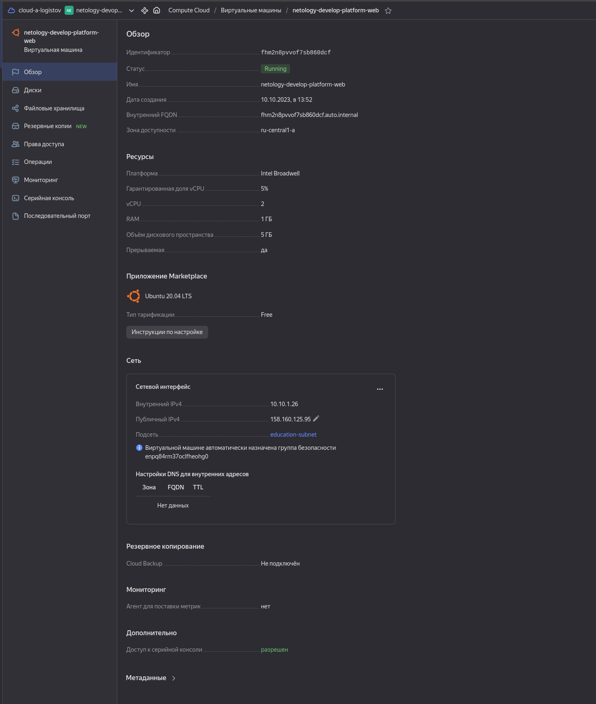
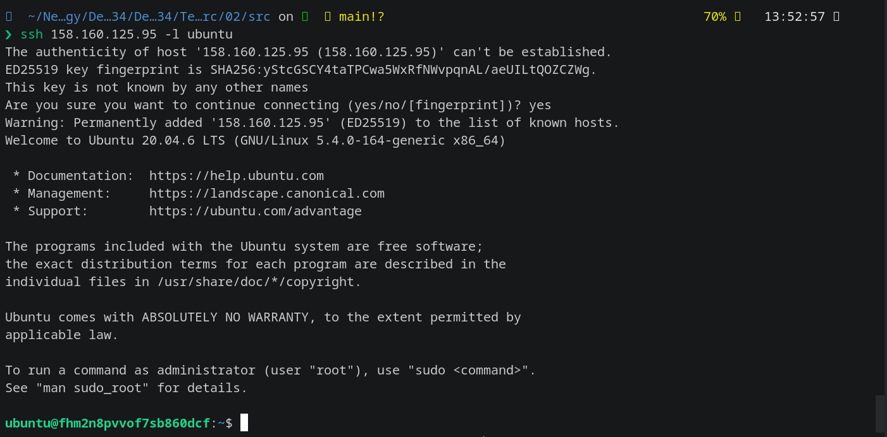
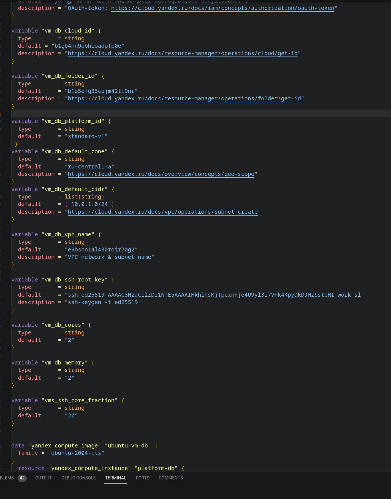
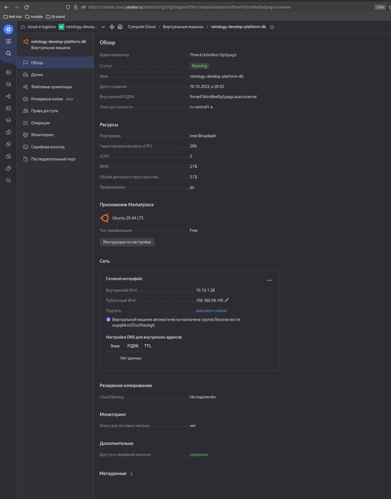

Домашнее задание к занятию «Основы Terraform. Yandex Cloud»
Цели задания

    Создать свои ресурсы в облаке Yandex Cloud с помощью Terraform.
    Освоить работу с переменными Terraform.

Чек-лист готовности к домашнему заданию

- [x]         Зарегистрирован аккаунт в Yandex Cloud. Использован промокод на грант.
- [x]         Установлен инструмент Yandex CLI.
- [x]         Исходный код для выполнения задания расположен в директории 02/src.

Задание 0

    Ознакомьтесь с документацией к security-groups в Yandex Cloud.
    Запросите preview-доступ к этому функционалу в личном кабинете Yandex Cloud. Обычно его выдают в течение 24-х часов. https://console.cloud.yandex.ru/folders/<ваш cloud_id>/vpc/security-groups.
    Этот функционал понадобится к следующей лекции.

Внимание!! Обязательно предоставляем на проверку получившийся код в виде ссылки на ваш github-репозиторий!
## Задание 1

В качестве ответа всегда полностью прикладывайте ваш terraform-код в git.

- Изучите проект. В файле variables.tf объявлены переменные для Yandex provider.
- Переименуйте файл personal.auto.tfvars_example в personal.auto.tfvars. Заполните переменные: идентификаторы облака, токен доступа. Благодаря .gitignore этот файл не попадёт в публичный репозиторий. Вы можете выбрать иной способ безопасно передать секретные данные в terraform.
- Сгенерируйте или используйте свой текущий ssh-ключ. Запишите его открытую часть в переменную vms_ssh_root_key.
- Инициализируйте проект, выполните код. Исправьте намеренно допущенные синтаксические ошибки. Ищите внимательно, посимвольно. Ответьте, в чём заключается их суть.
- Ответьте, как в процессе обучения могут пригодиться параметры preemptible = true и core_fraction=5 в параметрах ВМ. Ответ в документации Yandex Cloud.

В качестве решения приложите:

- скриншот ЛК Yandex Cloud с созданной ВМ;
- скриншот успешного подключения к консоли ВМ через ssh. К OS ubuntu необходимо подключаться под пользователем ubuntu: "ssh ubuntu@vm_ip_address";
- oтветы на вопросы.

## Задание 2

- Изучите файлы проекта.
- Замените все хардкод-значения для ресурсов yandex_compute_image и yandex_compute_instance на отдельные переменные. К названиям переменных ВМ добавьте в начало префикс vm_web_ . Пример: vm_web_name.
- Объявите нужные переменные в файле variables.tf, обязательно указывайте тип переменной. Заполните их default прежними значениями из main.tf.
- Проверьте terraform plan. Изменений быть не должно.

## Задание 3

- Создайте в корне проекта файл 'vms_platform.tf' . Перенесите в него все переменные первой ВМ.
- Скопируйте блок ресурса и создайте с его помощью вторую ВМ в файле main.tf: "netology-develop-platform-db" , cores = 2, memory = 2, core_fraction = 20. Объявите её переменные с префиксом vm_db_ в том же файле ('vms_platform.tf').
- Примените изменения.

## Задание 4

- Объявите в файле outputs.tf output типа map, содержащий { instance_name = external_ip } для каждой из ВМ.
- Примените изменения.

В качестве решения приложите вывод значений ip-адресов команды terraform output.
## Задание 5

- В файле locals.tf опишите в одном local-блоке имя каждой ВМ, используйте интерполяцию ${..} с несколькими переменными по примеру из лекции.
- Замените переменные с именами ВМ из файла variables.tf на созданные вами local-переменные.
- Примените изменения.

## Задание 6

- Вместо использования трёх переменных ".._cores",".._memory",".._core_fraction" в блоке resources {...}, объедините их в переменные типа map с именами "vm_web_resources" и "vm_db_resources". В качестве продвинутой практики попробуйте создать одну map-переменную vms_resources и уже внутри неё конфиги обеих ВМ — вложенный map.
- Также поступите с блоком metadata {serial-port-enable, ssh-keys}, эта переменная должна быть общая для всех ваших ВМ.
- Найдите и удалите все более не используемые переменные проекта.
- Проверьте terraform plan. Изменений быть не должно.

## Дополнительное задание (со звёздочкой*)

Настоятельно рекомендуем выполнять все задания со звёздочкой.
Они помогут глубже разобраться в материале. Задания со звёздочкой дополнительные, не обязательные к выполнению и никак не повлияют на получение вами зачёта по этому домашнему заданию.
Задание 7*

Изучите содержимое файла console.tf. Откройте terraform console, выполните следующие задания:

- Напишите, какой командой можно отобразить второй элемент списка test_list.
- Найдите длину списка test_list с помощью функции length(<имя переменной>).
- Напишите, какой командой можно отобразить значение ключа admin из map test_map.
- Напишите interpolation-выражение, результатом которого будет: "John is admin for production server based on OS ubuntu-20-04 with X vcpu, Y ram and Z virtual disks", используйте данные из переменных test_list, test_map, servers и функцию length() для подстановки значений.

В качестве решения предоставьте необходимые команды и их вывод.
Правила приёма работы

В git-репозитории, в котором было выполнено задание к занятию «Введение в Terraform», создайте новую ветку terraform-02, закоммитьте в эту ветку свой финальный код проекта. Ответы на задания и необходимые скриншоты оформите в md-файле в ветке terraform-02.

В качестве результата прикрепите ссылку на ветку terraform-02 в вашем репозитории.

Важно. Удалите все созданные ресурсы.
Критерии оценки

Зачёт ставится, если:

- [x]         выполнены все задания,
- [x]         ответы даны в развёрнутой форме,
- [x]         приложены соответствующие скриншоты и файлы проекта,
- [x]        в выполненных заданиях нет противоречий и нарушения логики.

На доработку работу отправят, если:

    задание выполнено частично или не выполнено вообще,
    в логике выполнения заданий есть противоречия и существенные недостатки.


 _________________________________________________________

## Решение 1:
Вывод команды terrafrom apply: 
``` bash

terraform apply
data.yandex_compute_image.ubuntu: Reading...
data.yandex_compute_image.ubuntu: Read complete after 1s [id=fd826honb8s0i1jtt6cg]

Terraform used the selected providers to generate the following execution plan. Resource actions are indicated
with the following symbols:
  + create

Terraform will perform the following actions:

  # yandex_compute_instance.platform will be created
  + resource "yandex_compute_instance" "platform" {
      + created_at                = (known after apply)
      + folder_id                 = (known after apply)
      + fqdn                      = (known after apply)
      + gpu_cluster_id            = (known after apply)
      + hostname                  = (known after apply)
      + id                        = (known after apply)
      + metadata                  = {
          + "serial-port-enable" = "1"
          + "ssh-keys"           = "ubuntu:ssh-ed25519 ### "
        }
      + name                      = "netology-develop-platform-web"
      + network_acceleration_type = "standard"
      + platform_id               = "standard-v1"
      + service_account_id        = (known after apply)
      + status                    = (known after apply)
      + zone                      = (known after apply)

      + boot_disk {
          + auto_delete = true
          + device_name = (known after apply)
          + disk_id     = (known after apply)
          + mode        = (known after apply)

          + initialize_params {
              + block_size  = (known after apply)
              + description = (known after apply)
              + image_id    = "fd826honb8s0i1jtt6cg"
              + name        = (known after apply)
              + size        = (known after apply)
              + snapshot_id = (known after apply)
              + type        = "network-hdd"
            }
        }

      + network_interface {
          + index              = (known after apply)
          + ip_address         = (known after apply)
          + ipv4               = true
          + ipv6               = (known after apply)
          + ipv6_address       = (known after apply)
          + mac_address        = (known after apply)
          + nat                = true
          + nat_ip_address     = (known after apply)
          + nat_ip_version     = (known after apply)
          + security_group_ids = (known after apply)
          + subnet_id          = "e9bsnn14l430roir70g2"
        }

      + resources {
          + core_fraction = 5
          + cores         = 2
          + memory        = 1
        }

      + scheduling_policy {
          + preemptible = true
        }
    }

Plan: 1 to add, 0 to change, 0 to destroy.

Do you want to perform these actions?
  Terraform will perform the actions described above.
  Only 'yes' will be accepted to approve.

  Enter a value: yes

yandex_compute_instance.platform: Creating...
yandex_compute_instance.platform: Still creating... [10s elapsed]
yandex_compute_instance.platform: Still creating... [20s elapsed]
yandex_compute_instance.platform: Still creating... [30s elapsed]
yandex_compute_instance.platform: Still creating... [40s elapsed]
yandex_compute_instance.platform: Creation complete after 47s [id=fhm2n8pvvof7sb860dcf]

Apply complete! Resources: 1 added, 0 changed, 0 destroyed.


```

Скриншот из YC:   




Подключенеие по ssh к вновь созданной ВМ. 



<b>Ответы на вопрос:</b> <i>Как в процессе обучения могут пригодиться параметры preemptible = true и core_fraction=5 в параметрах ВМ. Ответ в документации Yandex Cloud.</i>

- <b> preemptible VM </b> - прерываемые ВМ, хороши тем, что если при выполнении ДЗ забыть ее выключить, она будет выключена через случайный момент в промежутке 22-24 часа с момента запуска. Так же этот тип ВМ удобен тем, что если в указанной зоне не будет хватать ресурсов для запуска обычной ВМ, прерываемая будет выключена автоматически.

- <b> core_fraction </b> - уровень производительности CPU. От его значения зависит стоимость ВМ и вычислительные возможности. Виртуальные машины с уровнем производительности меньше 100% имеют доступ к вычислительной мощности физических ядер как минимум на протяжении указанного процента от единицы времени.

## Решение 2:

После изменения файла ```variables.tf``` с добавлением к именам переменных ```vm_web``` c последующим изменением файлов проекта, выполнил команду ```terraform plan```
Вывод команды ниже: 

``` bash
❯ terraform plan
data.yandex_compute_image.ubuntu: Reading...
data.yandex_compute_image.ubuntu: Read complete after 0s [id=fd826honb8s0i1jtt6cg]
yandex_compute_instance.platform: Refreshing state... [id=fhm2n8pvvof7sb860dcf]

No changes. Your infrastructure matches the configuration.

Terraform has compared your real infrastructure against your configuration and found no differences, so no changes are needed.
```


## Решение 3:

В корне проекта был создан файл ```vms_platform.tf ``` 
Переменные указаны в начале файла: 

После выполнены команды:   
```terraform plan```

```terraform apply```
``` bash
terraform apply
data.yandex_compute_image.ubuntu-vm-db: Reading...
data.yandex_compute_image.ubuntu: Reading...
data.yandex_compute_image.ubuntu-vm-db: Read complete after 1s [id=fd826honb8s0i1jtt6cg]
data.yandex_compute_image.ubuntu: Read complete after 1s [id=fd826honb8s0i1jtt6cg]
yandex_compute_instance.platform: Refreshing state... [id=fhm2n8pvvof7sb860dcf]

Terraform used the selected providers to generate the following execution plan. Resource actions are indicated with the following symbols:
  + create

Terraform will perform the following actions:

  # yandex_compute_instance.platform-db will be created
  + resource "yandex_compute_instance" "platform-db" {
      + created_at                = (known after apply)
      + folder_id                 = (known after apply)
      + fqdn                      = (known after apply)
      + gpu_cluster_id            = (known after apply)
      + hostname                  = (known after apply)
      + id                        = (known after apply)
      + metadata                  = {
          + "serial-port-enable" = "1"
          + "ssh-keys"           = "ubuntu:ssh-ed25519 ###" #  Открытая часть ключа намеренo убрана
        }
      + name                      = "netology-develop-platform-db"
      + network_acceleration_type = "standard"
      + platform_id               = "standard-v1"
      + service_account_id        = (known after apply)
      + status                    = (known after apply)
      + zone                      = (known after apply)

      + boot_disk {
          + auto_delete = true
          + device_name = (known after apply)
          + disk_id     = (known after apply)
          + mode        = (known after apply)

          + initialize_params {
              + block_size  = (known after apply)
              + description = (known after apply)
              + image_id    = "fd826honb8s0i1jtt6cg"
              + name        = (known after apply)
              + size        = (known after apply)
              + snapshot_id = (known after apply)
              + type        = "network-hdd"
            }
        }

      + network_interface {
          + index              = (known after apply)
          + ip_address         = (known after apply)
          + ipv4               = true
          + ipv6               = (known after apply)
          + ipv6_address       = (known after apply)
          + mac_address        = (known after apply)
          + nat                = true
          + nat_ip_address     = (known after apply)
          + nat_ip_version     = (known after apply)
          + security_group_ids = (known after apply)
          + subnet_id          = "e9bsnn14l430roir70g2"
        }

      + resources {
          + core_fraction = 20
          + cores         = 2
          + memory        = 2
        }

      + scheduling_policy {
          + preemptible = true
        }
    }

Plan: 1 to add, 0 to change, 0 to destroy.

Do you want to perform these actions?
  Terraform will perform the actions described above.
  Only 'yes' will be accepted to approve.

  Enter a value: yes

yandex_compute_instance.platform-db: Creating...
yandex_compute_instance.platform-db: Still creating... [10s elapsed]
yandex_compute_instance.platform-db: Still creating... [20s elapsed]
yandex_compute_instance.platform-db: Still creating... [30s elapsed]
yandex_compute_instance.platform-db: Creation complete after 33s [id=fhme41k6m9bel5p5pags]

Apply complete! Resources: 1 added, 0 changed, 0 destroyed.


```



## Решение 4:
 
В файле ```outputs.tf```:    
``` bash
output "vm_ips" {
  value = {
    netology-develop-platform-web = "158.160.33.19"
    netology-develop-platform-db  = "158.160.33.115"
  }
}
```

``` bash 
terraform apply
data.yandex_compute_image.ubuntu-vm-db: Reading...
data.yandex_compute_image.ubuntu: Reading...
data.yandex_compute_image.ubuntu-vm-db: Read complete after 0s [id=fd826honb8s0i1jtt6cg]
data.yandex_compute_image.ubuntu: Read complete after 0s [id=fd826honb8s0i1jtt6cg]
yandex_compute_instance.platform-db: Refreshing state... [id=fhme41k6m9bel5p5pags]
yandex_compute_instance.platform: Refreshing state... [id=fhm2n8pvvof7sb860dcf]

Changes to Outputs:
  + vm_ips = {
      + netology-develop-platform-db  = "158.160.33.115"
      + netology-develop-platform-web = "158.160.33.19"
    }

You can apply this plan to save these new output values to the Terraform state, without changing any real infrastructure.

Do you want to perform these actions?
  Terraform will perform the actions described above.
  Only 'yes' will be accepted to approve.

  Enter a value: yes


Apply complete! Resources: 0 added, 0 changed, 0 destroyed.

Outputs:

vm_ips = {
  "netology-develop-platform-db" = "158.160.33.115"
  "netology-develop-platform-web" = "158.160.33.19"
}


```


## Решение 5:
В файле ```locals.tf``` 
``` bash
locals {
  vm_web = "${var.company}-${var.dev}-${var.vm_name}-${var.vm_web}"
  vm_db = "${var.company}-${var.dev}-${var.vm_name}-${var.vm_db}"
}
```
В файле ```variables.tf```
```bash
variable "company" {
  default = "netology"
}

variable "dev" {
  default = "develop"
}

variable "vm_name" {
  default = "plarform"
}

variable "vm_web" {
  default = "web"
}
variable "vm_db" {
  default = "db"
}
```

```bash 
resource "yandex_compute_instance" "platform" {
  name        = local.vm_web
```

``` bash
resource "yandex_compute_instance" "platform-db" {
  name        = local.vm_db
```


## Решение 6:

В файле ```variables.tf``` 
``` bash
variable "vms_resources" {
  type = map
  default = {
    vm_web_resources = {
      cores = 2
      memory = 1
      core_fraction = 5
    }
    vm_db_resources = {
      cores = 2
      memory = 2
      core_fraction = 20
    }
  }
}

variable "metadata" {
  type = map
  default = {
    serial-port-enable = true
    ssh-keys = "ssh-ed25519 ###" # Открытая часть ключа скрыта намерено 
  }
}

```
В файле: ```main.tf ``` 
``` bash 
resources {
    cores         = var.vms_resources.vm_web_resources.cores # Минимальное значение vCPU = 2. ccылка: https://cloud.yandex.ru/docs/compute/concepts/performance-levels
    memory        = var.vms_resources.vm_web_resources.memory
    core_fraction = var.vms_resources.vm_web_resources.core_fraction
  }

metadata = {
    serial-port-enable = var.metadata.serial-port-enable
    ssh-keys           = var.metadata.ssh-keys
  }
```

В файле: ```vms_platform.tf```
``` bash
resources {
    cores         = var.vms_resources.vm_db_resources.cores # Минимальное значение vCPU = 2. ccылка: https://cloud.yandex.ru/docs/compute/concepts/performance-levels
    memory        = var.vms_resources.vm_db_resources.memory
    core_fraction = var.vms_resources.vm_db_resources.core_fraction
  }

metadata = {
    serial-port-enable = var.metadata.serial-port-enable
    ssh-keys           = var.metadata.ssh-keys
  }

```


## Решение 7 *:
Для перехода в terraform console пишем команду ```terraform console```   

Далее вывод команд: 


``` bash
local.test_list[1]
"staging"


> length(local.test_list)
3


> local.test_map["admin"]
"John"


> "${local.test_map["admin"]} is admin for ${local.servers["production"]["image"]} server based on OS ${local.servers["production"]["image"]} with ${local.servers["production"]["cpu"]} vcpu, ${local.servers["production"]["ram"]} ram and ${length(local.servers["production"]["disks"])} virtual disks"

"John is admin for ubuntu-20-04 server based on OS ubuntu-20-04 with 10 vcpu, 40 ram and 4 virtual disks"
>  

```