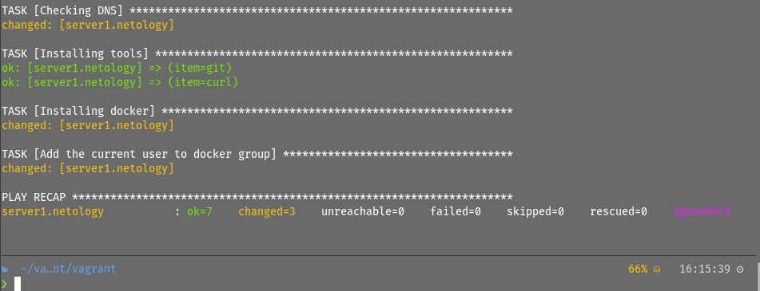
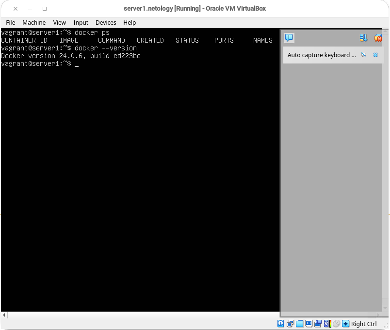
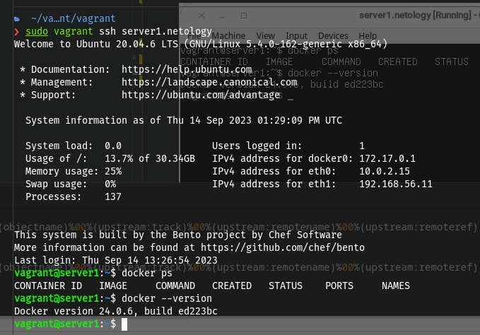

## Домашнее задание к занятию 2. «Применение принципов IaaC в работе с виртуальными машинами» 
_________________________________________________________

Задача 1:

    Опишите основные преимущества применения на практике IaaC-паттернов.
    Какой из принципов IaaC является основополагающим?
_________________________________________________________
Задача 2

    Чем Ansible выгодно отличается от других систем управление конфигурациями?
    Какой, на ваш взгляд, метод работы систем конфигурации более надёжный — push или pull?
_________________________________________________________
Задача 3

Установите на личный компьютер:

    VirtualBox, 
    Vagrant, 
    Terraform, 
    Ansible. 

Приложите вывод команд установленных версий каждой из программ, оформленный в Markdown.
_________________________________________________________
Задача 4

Воспроизведите практическую часть лекции самостоятельно.

    Создайте виртуальную машину.
    Зайдите внутрь ВМ, убедитесь, что Docker установлен с помощью команды

docker ps,

Vagrantfile из лекции и код ansible находятся в папке.

Примечание. Если Vagrant выдаёт ошибку:

URL: ["https://vagrantcloud.com/bento/ubuntu-20.04"]     
Error: The requested URL returned error: 404:

выполните следующие действия:

    Скачайте с сайта файл-образ "bento/ubuntu-20.04".
    Добавьте его в список образов Vagrant: "vagrant box add bento/ubuntu-20.04 <путь к файлу>".

Приложите скриншоты в качестве решения на эту задачу.
_________________________________________________________

## Решение 1: 
IaaC (Infrastructure as Code) - это подход к управлению инфраструктурой, при котором инфраструктура описывается в виде кода. Основные преимущества применения IaaC-паттернов на практике включают:

    Автоматизация: IaaC позволяет автоматизировать процесс развертывания и управления инфраструктурой. Это позволяет снизить ручной труд, упростить процесс и улучшить его надежность.

    Повторяемость и консистентность: Использование IaaC позволяет создавать инфраструктуру с помощью кода, что обеспечивает повторяемость и консистентность. Это означает, что вы можете легко воспроизвести и развернуть одинаковую инфраструктуру в разных средах.

    Версионирование и контроль изменений: IaaC позволяет хранить инфраструктурный код в системе контроля версий, такой как Git. Это обеспечивает возможность версионирования, отслеживания изменений и восстановления предыдущих состояний инфраструктуры.

    Масштабируемость: IaaC позволяет легко масштабировать инфраструктуру, добавлять и удалять ресурсы, настраивать параметры и управлять конфигурацией с помощью кода.

    Документация и совместная работа: Инфраструктурный код, созданный с помощью IaaC, служит документацией для инфраструктуры. Он также способствует совместной работе, позволяя командам разработки и операций работать над инфраструктурой вместе.


Основополагающим принципом IaaC является декларативность. Вместо того, чтобы описывать шаги для достижения определенного состояния инфраструктуры, декларативный подход позволяет описывать желаемое состояние инфраструктуры, а инструменты IaaC заботятся о том, как достичь этого состояния.

_________________________________________________________

## Решение 2: 

Ansible выгодно отличается от других систем управления конфигурацией следующими особенностями:

    Простота и легковесность: Ansible использует простой и понятный язык описания конфигурации, основанный на YAML. Он не требует установки агентов на управляемые узлы, что делает его легковесным и простым в использовании.

    Агент less архитектура: Ansible работает по принципу "push", что означает, что нет необходимости устанавливать агенты на управляемые узлы. Ansible управляет узлами через SSH или другие протоколы, что делает его гибким и удобным для использования в различных средах.

    Масштабируемость и гибкость: Ansible позволяет управлять как небольшими, так и крупными инфраструктурами. Он поддерживает параллельное выполнение задач и имеет возможность группировки узлов для удобного управления.

    Широкий спектр интеграций: Ansible интегрируется с различными инструментами и платформами, позволяя автоматизировать не только управление конфигурацией, но и другие аспекты DevOps, такие как развертывание приложений, управление сетями и облачными ресурсами.

    Открытость и активное сообщество: Ansible является open-source проектом и имеет активное сообщество разработчиков и пользователей. Это означает, что есть множество ресурсов, документации и модулей, которые помогут вам начать работу и решить различные задачи.


Относительно метода работы систем конфигурации, надежность может зависеть от конкретной ситуации и требований.

Pull и push - это два основных метода синхронизации данных между клиентом и сервером в распределенных системах. Оба метода имеют свои преимущества и недостатки, и выбор между ними зависит от конкретных требований и ограничений вашего приложения.

Pull метод подразумевает, что клиент активно запрашивает данные у сервера. Когда клиент хочет получить обновленные данные, он отправляет запрос на сервер, и сервер отвечает, предоставляя актуальные данные. Этот метод обычно используется в асинхронных системах, где клиенты не требуют непрерывного обновления данных и могут работать с устаревшими данными в течение некоторого времени.

Push метод, напротив, предполагает, что сервер активно отправляет обновления клиентам, когда данные изменяются. Когда сервер обнаруживает изменения данных, он автоматически отправляет обновления клиентам. Этот метод обычно используется в реальном времени или в системах, где клиенты требуют непрерывного обновления данных и не могут работать с устаревшими данными.

Если говорить про надежность обоих методов, то можно сказать так:

Оба метода имеют свои преимущества и недостатки, и надежность зависит от конкретной ситуации и требований вашего приложения. 

Pull метод более прост в реализации и управлении, так как клиенты активно запрашивают данные у сервера. Он также может быть более эффективным с точки зрения использования ресурсов, так как данные передаются только при необходимости. Однако, если клиенты не запрашивают данные вовремя, они могут работать с устаревшими данными.

Push метод обеспечивает более непрерывное обновление данных и может быть полезен в реальном времени или в системах, где актуальность данных критически важна. Однако, он может быть более сложным в реализации и управлении, так как сервер должен активно отправлять обновления клиентам. Это также может привести к большему использованию ресурсов, так как данные передаются непрерывно, даже если клиенты не нуждаются в них.


В итоге, выбор между pull и push методами зависит от конкретных требований вашего приложения и ограничений вашей сетевой инфраструктуры. Некоторые приложения могут использовать комбинацию обоих методов в зависимости от контекста и требований.


## Комментарий от преподователя Ксения Дикова:
16 сентября 2023 18:42

Здравствуйте, Сергей!
Спасибо за выполненную работу.
Работа сделана отлично, вижу, что удалось установить все необходимые программы.
По поводу 2 задания, вы так и не дали ответ на вопрос, какой метод надежнее, подумайте, что произойдет, если во время сеанса у вас пропадет интернет соединение, какой метод в этом случае надежнее, pull или push, и почему.
_________________________________________________________
Ответ: 

Если во время сеанса у вас пропадет интернет соединение, то <b>pull</b> метод будет более надежным. В <b>pull</b> методе клиент активно запрашивает данные у сервера, поэтому если интернет соединение пропадет, клиент просто не сможет получить обновленные данные. Однако, когда интернет соединение восстановится, клиент сможет снова запрашивать данные и получить актуальную информацию.

С другой стороны, <b>push</b> метод предполагает, что сервер активно отправляет обновления клиентам. Если во время пропадания интернет соединения сервер отправит обновление, клиент не сможет его получить, и данные могут быть потеряны. Когда интернет соединение восстановится, клиент может пропустить обновления, которые были отправлены во время отсутствия связи.

Таким образом, в случае пропадания интернет соединения, <b>pull</b> метод более надежен, так как клиент активно запрашивает данные и может получить их, когда связь восстановится.
_________________________________________________________

## Решение 3: 

```terraform --version ```         
```
Terraform v1.5.7
on linux_amd64
```

```ansible --version```                                                
```
ansible [core 2.14.8]
  config file = /etc/ansible/ansible.cfg
  configured module search path = ['/home/l1is/.ansible/plugins/modules', '/usr/share/ansible/plugins/modules']
  ansible python module location = /usr/lib/python3.11/site-packages/ansible
  ansible collection location = /home/l1is/.ansible/collections:/usr/share/ansible/collections
  executable location = /usr/bin/ansible
  python version = 3.11.5 (main, Aug 28 2023, 00:00:00) [GCC 13.2.1 20230728 (Red Hat 13.2.1-1)] (/usr/bin/python3)
  jinja version = 3.0.3
  libyaml = True
```

```vagrant --version```
```
Vagrant 2.3.7
```
```VirtualBox Версия 7.0.10_rpmfusion r15837```
_________________________________________________________


## Решение 4: 

Была выполнена команда ``` sudo vagrant up ```






Так проверил работоспособность путем выполнения команды ```sudo vagrant ssh server1.netology```

_________________________________________________________