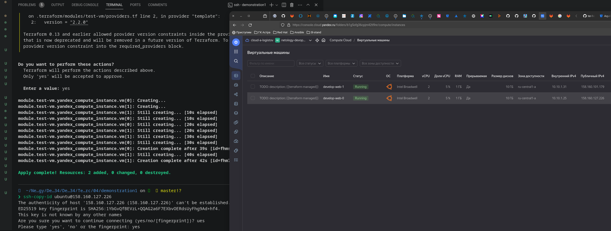
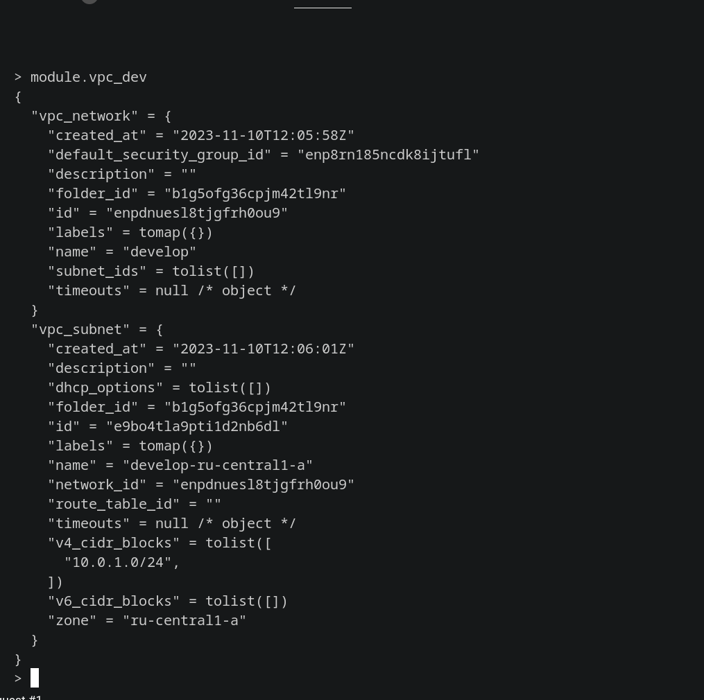
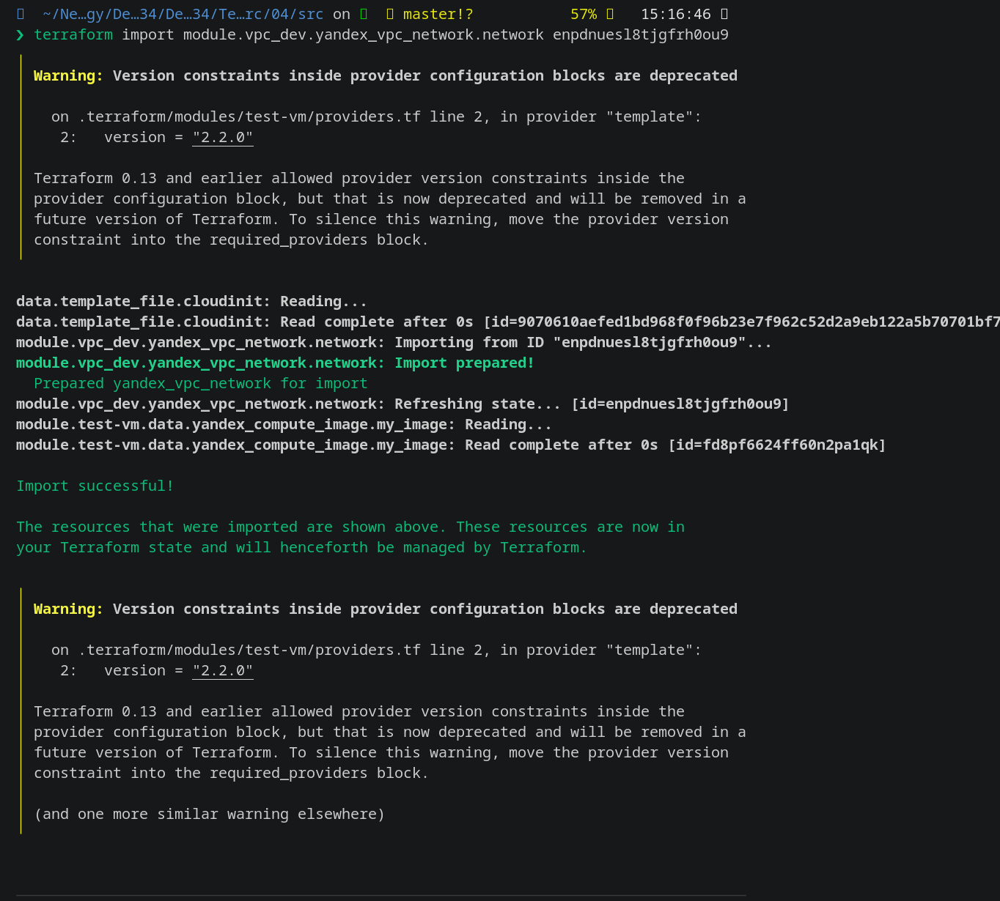
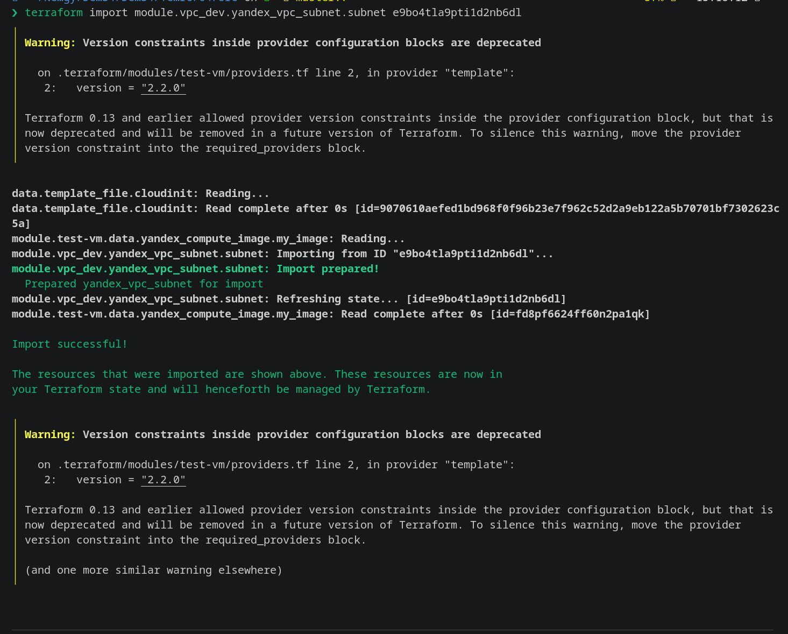
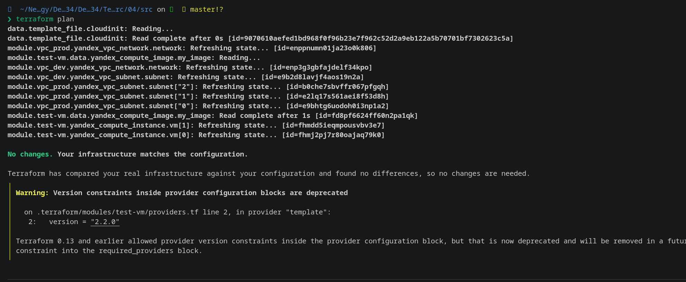

Цели задания

    Научиться использовать модули.
    Отработать операции state.
    Закрепить пройденный материал.

Чек-лист готовности к домашнему заданию

    Зарегистрирован аккаунт в Yandex Cloud. Использован промокод на грант.
    Установлен инструмент Yandex CLI.
    Исходный код для выполнения задания расположен в директории 04/src.
    Любые ВМ, использованные при выполнении задания, должны быть прерываемыми, для экономии средств.

Внимание!! Обязательно предоставляем на проверку получившийся код в виде ссылки на ваш github-репозиторий!
Убедитесь что ваша версия Terraform =1.5.5 (версия 1.6 может вызывать проблемы с Яндекс провайдером) Пишем красивый код, хардкод значения не допустимы!
## Задание 1

    Возьмите из демонстрации к лекции готовый код для создания ВМ с помощью remote-модуля.
    Создайте одну ВМ, используя этот модуль. В файле cloud-init.yml необходимо использовать переменную для ssh-ключа вместо хардкода. Передайте ssh-ключ в функцию template_file в блоке vars ={} . Воспользуйтесь примером. Обратите внимание, что ssh-authorized-keys принимает в себя список, а не строку.
    Добавьте в файл cloud-init.yml установку nginx.
    Предоставьте скриншот подключения к консоли и вывод команды sudo nginx -t.
``` bash
ubuntu@develop-web-0:~$ sudo nginx -t
nginx: the configuration file /etc/nginx/nginx.conf syntax is ok
nginx: configuration file /etc/nginx/nginx.conf test is successful
ubuntu@develop-web-0:~$
```
 
|
## Задание 2

- Напишите локальный модуль vpc, который будет создавать 2 ресурса: одну сеть и одну подсеть в зоне, объявленной при вызове модуля, например: ru-central1-a.
- Вы должны передать в модуль переменные с названием сети, zone и v4_cidr_blocks.
- Модуль должен возвращать в root module с помощью output информацию о yandex_vpc_subnet. Пришлите скриншот информации из terraform console о своем модуле. Пример: > module.vpc_dev
- Замените ресурсы yandex_vpc_network и yandex_vpc_subnet созданным модулем. Не забудьте передать необходимые параметры сети из модуля vpc в модуль с виртуальной машиной.
- Откройте terraform console и предоставьте скриншот содержимого модуля. Пример: > module.vpc_dev.
- Сгенерируйте документацию к модулю с помощью terraform-docs.

#### Пример вызова

module "vpc_dev" {
  source       = "./vpc"
  env_name     = "develop"
  zone = "ru-central1-a"
  cidr = "10.0.1.0/24"
}
``` bash 
terraform console
> module.vpc_dev
```




## Задание 3

- Выведите список ресурсов в стейте.
``` terraform state list ```

-    Полностью удалите из стейта модуль vpc.
``` terraform state rm module.vpc_dev```

-    Полностью удалите из стейта модуль vm.
``` terraform state rm module.test-vm```


-    Импортируйте всё обратно. Проверьте terraform plan. Изменений быть не должно.   

``` terraform import module.vpc_dev.yandex_vpc_network.network id```


``` terraform import module.vpc_dev.yandex_vpc_subnet.subnet id```



``` terraform import module.test-vm.yandex_compute_instance.vm[0] id ```

``` terraform import module.test-vm.yandex_compute_instance.vm[1] id```


- Приложите список - - выполненных команд и скриншоты процессы.

## Дополнительные задания (со звёздочкой*)

Настоятельно рекомендуем выполнять все задания со звёздочкой. Они помогут глубже разобраться в материале.
Задания со звёздочкой дополнительные, не обязательные к выполнению и никак не повлияют на получение вами зачёта по этому домашнему заданию.
Задание 4*

    Измените модуль vpc так, чтобы он мог создать подсети во всех зонах доступности, переданных в переменной типа list(object) при вызове модуля.

Пример вызова
```
module "vpc_prod" {
  source       = "./vpc"
  env_name     = "production"
  subnets = [
    { zone = "ru-central1-a", cidr = "10.0.1.0/24" },
    { zone = "ru-central1-b", cidr = "10.0.2.0/24" },
    { zone = "ru-central1-c", cidr = "10.0.3.0/24" },
  ]
}

module "vpc_dev" {
  source       = "./vpc"
  env_name     = "develop"
  subnets = [
    { zone = "ru-central1-a", cidr = "10.0.1.0/24" },
  ]
}
```

Предоставьте код, план выполнения, результат из консоли YC.
Задание 5*

    Напишите модуль для создания кластера managed БД Mysql в Yandex Cloud с одним или несколькими(2 по умолчанию) хостами в зависимости от переменной HA=true или HA=false. Используйте ресурс yandex_mdb_mysql_cluster: передайте имя кластера и id сети.
    Напишите модуль для создания базы данных и пользователя в уже существующем кластере managed БД Mysql. Используйте ресурсы yandex_mdb_mysql_database и yandex_mdb_mysql_user: передайте имя базы данных, имя пользователя и id кластера при вызове модуля.
    Используя оба модуля, создайте кластер example из одного хоста, а затем добавьте в него БД test и пользователя app. Затем измените переменную и превратите сингл хост в кластер из 2-х серверов.
    Предоставьте план выполнения и по возможности результат. Сразу же удаляйте созданные ресурсы, так как кластер может стоить очень дорого. Используйте минимальную конфигурацию.

Задание 6*

    Разверните у себя локально vault, используя docker-compose.yml в проекте.
    Для входа в web-интерфейс и авторизации terraform в vault используйте токен "education".
    Создайте новый секрет по пути http://127.0.0.1:8200/ui/vault/secrets/secret/create Path: example
    secret data key: test secret data value: congrats!
    Считайте этот секрет с помощью terraform и выведите его в output по примеру:

provider "vault" {
 address = "http://<IP_ADDRESS>:<PORT_NUMBER>"
 skip_tls_verify = true
 token = "education"
}
data "vault_generic_secret" "vault_example"{
 path = "secret/example"
}

output "vault_example" {
 value = "${nonsensitive(data.vault_generic_secret.vault_example.data)}"
} 

Можно обратиться не к словарю, а конкретному ключу:
terraform console: >nonsensitive(data.vault_generic_secret.vault_example.data.<имя ключа в секрете>)

    Попробуйте самостоятельно разобраться в документации и записать новый секрет в vault с помощью terraform.

Правила приёма работы

В своём git-репозитории создайте новую ветку terraform-04, закоммитьте в эту ветку свой финальный код проекта. Ответы на задания и необходимые скриншоты оформите в md-файле в ветке terraform-04.

В качестве результата прикрепите ссылку на ветку terraform-04 в вашем репозитории.

Важно. Удалите все созданные ресурсы.
Критерии оценки

Зачёт ставится, если:

    выполнены все задания,
    ответы даны в развёрнутой форме,
    приложены соответствующие скриншоты и файлы проекта,
    в выполненных заданиях нет противоречий и нарушения логики.

На доработку работу отправят, если:

    задание выполнено частично или не выполнено вообще,
    в логике выполнения заданий есть противоречия и существенные недостатки.
