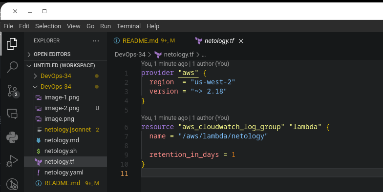
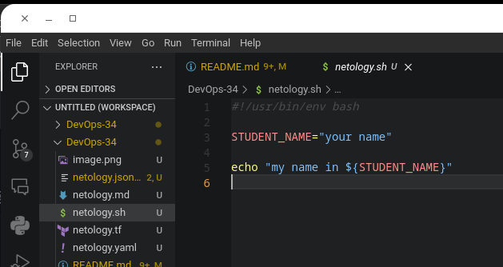
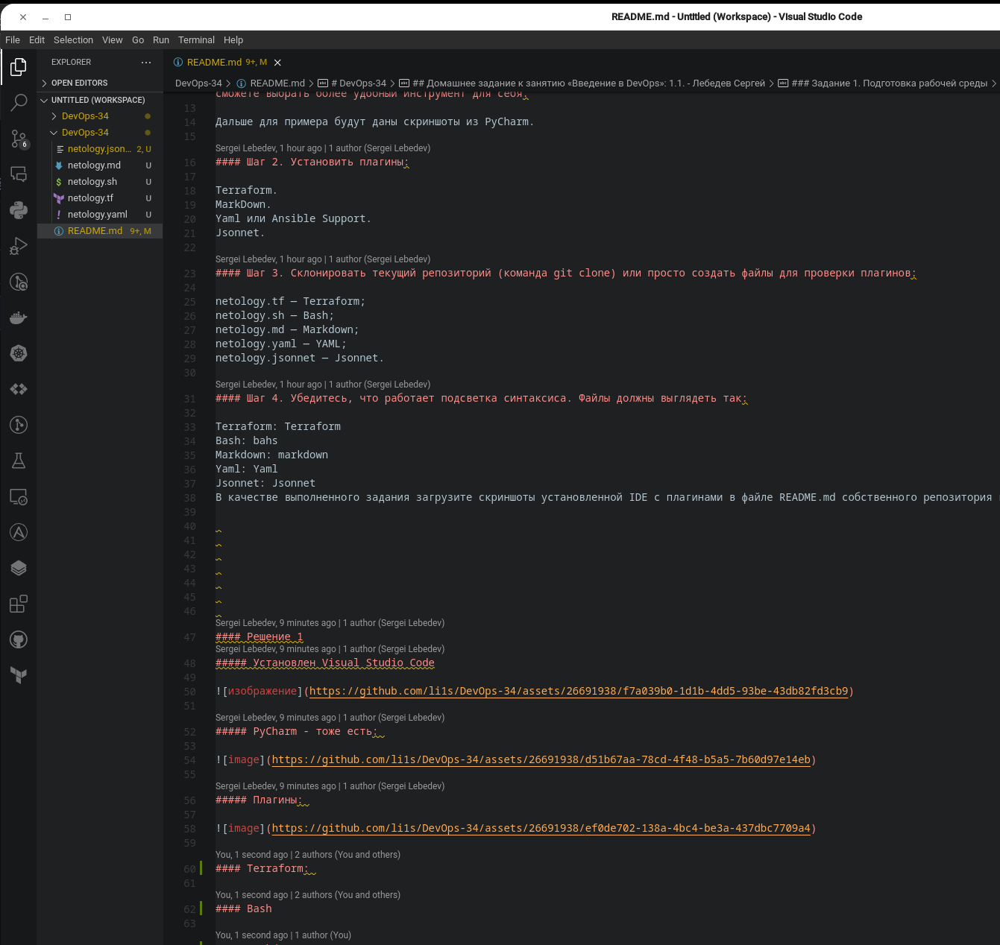
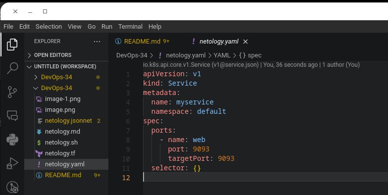
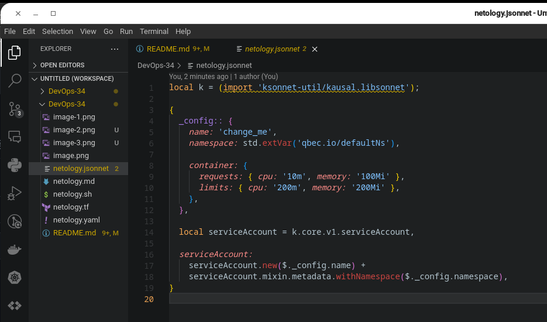

# DevOps-34
Обучение в НЕТОЛОГИИ на курсе DevOps. Группа - DevOps-34 ФИО - Лебедев Сергей Алексеевич

## Домашнее задание к занятию «Введение в DevOps»: 1.1. - Лебедев Сергей

### Задание 1. Подготовка рабочей среды
Вы пришли на новое место работы или приобрели новый компьютер. Сначала надо настроить окружение для дальнейшей работы.

Что нужно сделать

#### Шаг 1. Установить PyCharm Community Edition. Это бесплатная версия IDE. В качестве альтернативы можно установить Visual Studio Code и дальнейшие шаги проделать в нём. Так вы сможете выбрать более удобный инструмент для себя.

Дальше для примера будут даны скриншоты из PyCharm.

#### Шаг 2. Установить плагины:

Terraform.
MarkDown.
Yaml или Ansible Support.
Jsonnet.

#### Шаг 3. Склонировать текущий репозиторий (команда git clone) или просто создать файлы для проверки плагинов:

netology.tf — Terraform;
netology.sh — Bash;
netology.md — Markdown;
netology.yaml — YAML;
netology.jsonnet — Jsonnet.

#### Шаг 4. Убедитесь, что работает подсветка синтаксиса. Файлы должны выглядеть так:

Terraform: Terraform
Bash: bahs
Markdown: markdown
Yaml: Yaml
Jsonnet: Jsonnet
В качестве выполненного задания загрузите скриншоты установленной IDE с плагинами в файле README.md собственного репозитория в GitHub или в Google Doc.

#### Решение 1
##### Установлен Visual Studio Code

##### PyCharm - тоже есть: 

##### Плагины: 

__________________________________________________________________________________________________
#### Terraform: 

__________________________________________________________________________________________________
#### Bash

__________________________________________________________________________________________________
#### Markdown

__________________________________________________________________________________________________
#### Yaml

__________________________________________________________________________________________________
#### Jsonnet 

__________________________________________________________________________________________________

### Задание 2. Описание жизненного цикла задачи (разработки нового функционала)

Чтобы лучше понимать предназначение инструментов, с которыми вам предстоит работать, составим схему жизненного цикла задачи в идеальном для вас случае.
Описание истории

Представьте, что вы работаете в стартапе, который запустил интернет-магазин. Он достаточно успешно развивался, и пришло время налаживать процессы: у вас стало больше конечных клиентов, менеджеров и разработчиков.

Сейчас от клиентов вам приходят задачи, связанные с разработкой нового функционала. Задач много, и все они требуют выкладки на тестовые среды, одобрения тестировщика, проверки менеджером перед показом клиенту. В некоторых случаях вам будет необходим откат изменений.
Решение задачи

Вам нужно описать процесс решения задачи в соответствии с жизненным циклом разработки программного обеспечения. Использование конкретного метода разработки необязательно.

Для решения главное — прописать по пунктам шаги решения задачи (релизации в конечный результат) с участием менеджера, разработчика (или команды разработчиков), тестировщика (или команды тестировщиков) и себя как DevOps-инженера.

Ответ пришлите в свободной форме.

#### Решение 2
Текст и скриншоты ответа к заданию 2

Для решения задачи в соответствии с жизненным циклом разработки программного обеспечения можно использовать следующий подход:

    Получение задачи от клиента и создание соответствующего тикета в системе управления задачами.
    Разработка и тестирование функционала на локальном окружении разработчика.
    Выкладка функционала на тестовую среду, где его проверяют тестировщики.
    Внесение изменений на основе замечаний тестировщиков и повторное тестирование.
    Одобрение функционала менеджером и выкладка его на боевое окружение.
    Проверка корректности работы функционала на боевом окружении.
    В случае необходимости откат изменений на боевом окружении.

Как DevOps-инженеру нам необходимо обеспечить автоматизацию процессов разработки и выкладки функционала, а также наладить мониторинг и логирование системы. Кроме того, мы должны заботиться о безопасности приложения и обеспечивать его защиту от возможных угроз.
Для автоматизации процессов разработки и выкладки функционала можно использовать CI/CD-систему, которая будет автоматически собирать, тестировать и выкладывать изменения на тестовые и боевые серверы. Для этого необходимо настроить соответствующие скрипты и пайплайны.

Для мониторинга и логирования системы можно использовать специальные инструменты, такие как Prometheus, Grafana и ELK-стек, которые позволят отслеживать работу приложения и выявлять возможные проблемы.

Для обеспечения безопасности приложения можно использовать различные инструменты, такие как WAF, IDS/IPS, а также проводить регулярные аудиты безопасности и исправлять выявленные уязвимости.

Кроме того, важно обеспечить эффективное взаимодействие между разработчиками, тестировщиками, менеджерами и DevOps-инженерами. Для этого можно использовать специальные инструменты для управления задачами и коммуникации, такие как Jira, Slack или Microsoft Teams.

В целом, для эффективного решения задачи необходимо обеспечить тесное взаимодействие между всеми участниками процесса, автоматизировать процессы и обеспечить безопасность и мониторинг приложения. 
