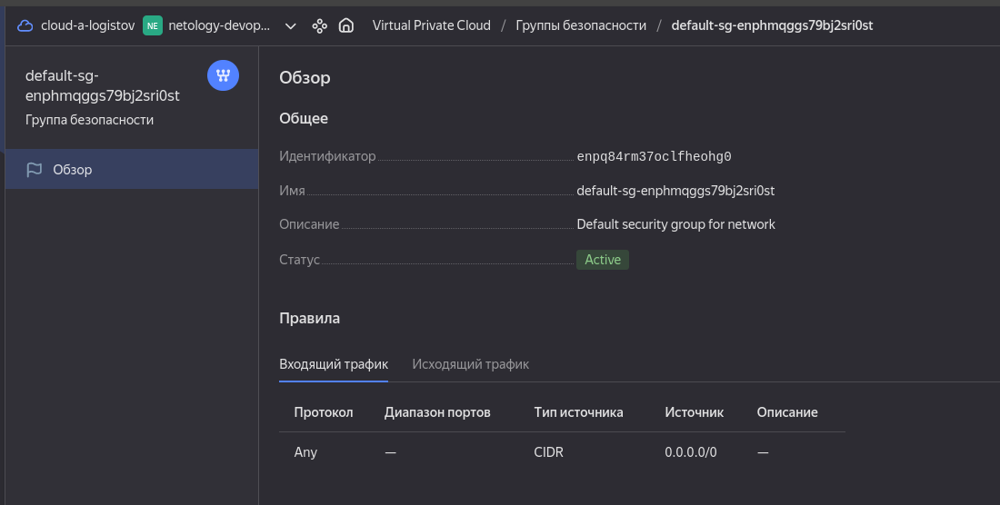
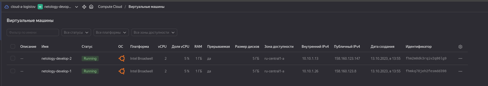
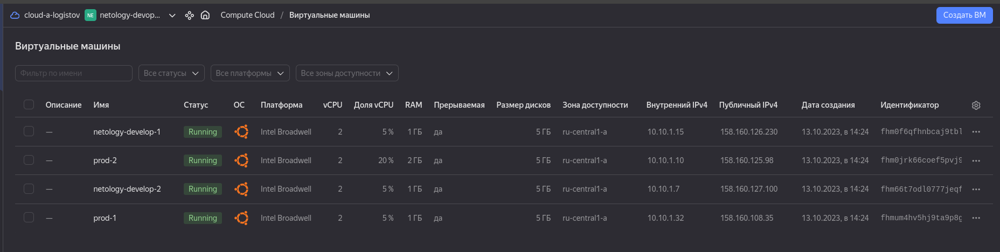
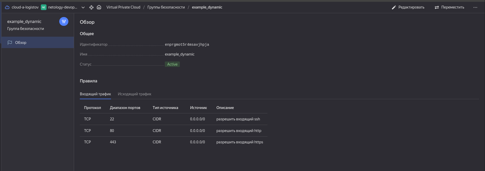

# Домашнее задание к занятию «Управляющие конструкции в коде Terraform»

## Цели задания

- Отработать основные принципы и методы работы с управляющими конструкциями Terraform.
- Освоить работу с шаблонизатором Terraform (Interpolation Syntax).

### Чек-лист готовности к домашнему заданию

- [x]         Зарегистрирован аккаунт в Yandex Cloud. Использован промокод на грант.
- [x]         Установлен инструмент Yandex CLI.
- [x]         Исходный код для выполнения задания расположен в директории 02/src.

Инструменты и дополнительные материалы, которые пригодятся для выполнения задания

- Консоль управления Yandex Cloud.
- Группы безопасности.
- Datasource compute disk.

<b><i>Внимание!! Обязательно предоставляем на проверку получившийся код в виде ссылки на ваш github-репозиторий!
Убедитесь что ваша версия Terraform =1.5.5 (версия 1.6 может вызывать проблемы с Яндекс провайдером)</b></i>

_________________________________________________________
## Задание 1

- [x] Изучите проект.
- [x] Заполните файл personal.auto.tfvars.
- [x] Инициализируйте проект, выполните код. Он выполнится, даже если доступа к preview нет.

<i>Примечание. Если у вас не активирован preview-доступ к функционалу «Группы безопасности» в Yandex Cloud, запросите доступ у поддержки облачного провайдера. Обычно его выдают в течение 24-х часов.</i>

Приложите скриншот входящих правил «Группы безопасности» в ЛК Yandex Cloud или скриншот отказа в предоставлении доступа к preview-версии.
 _________________________________________________________
## Задание 2

- Создайте файл count-vm.tf. Опишите в нём создание двух одинаковых ВМ web-1 и web-2 (не web-0 и web-1) с минимальными параметрами, используя мета-аргумент count loop. Назначьте ВМ созданную в первом задании группу безопасности.(как это сделать узнайте в документации провайдера yandex/compute_instance )
- Создайте файл for_each-vm.tf. Опишите в нём создание двух ВМ с именами "main" и "replica" разных по cpu/ram/disk , используя мета-аргумент for_each loop. Используйте для обеих ВМ одну общую переменную типа list(object({ vm_name=string, cpu=number, ram=number, disk=number })). При желании внесите в переменную все возможные параметры.
- ВМ из пункта 2.2 должны создаваться после создания ВМ из пункта 2.1.
- Используйте функцию file в local-переменной для считывания ключа ~/.ssh/id_rsa.pub и его последующего использования в блоке metadata, взятому из ДЗ 2.
- Инициализируйте проект, выполните код.


 _________________________________________________________
## Задание 3

- Создайте 3 одинаковых виртуальных диска размером 1 Гб с помощью ресурса yandex_compute_disk и мета-аргумента count в файле disk_vm.tf .
- Создайте в том же файле одиночную(использовать count или for_each запрещено из-за задания №4) ВМ c именем "storage" . Используйте блок dynamic secondary_disk{..} и мета-аргумент for_each для подключения созданных вами дополнительных дисков.
 _________________________________________________________
## Задание 4

- В файле ansible.tf создайте inventory-файл для ansible. Используйте функцию tepmplatefile и файл-шаблон для создания ansible inventory-файла из лекции. Готовый код возьмите из демонстрации к лекции demonstration2. Передайте в него в качестве переменных группы виртуальных машин из задания 2.1, 2.2 и 3.2, т. е. 5 ВМ.
- Инвентарь должен содержать 3 группы [webservers], [databases], [storage] и быть динамическим, т. е. обработать как группу из 2-х ВМ, так и 999 ВМ.
- Выполните код. Приложите скриншот получившегося файла.

Для общего зачёта создайте в вашем GitHub-репозитории новую ветку terraform-03. Закоммитьте в эту ветку свой финальный код проекта, пришлите ссылку на коммит.
Удалите все созданные ресурсы.
Дополнительные задания (со звездочкой*)

Настоятельно рекомендуем выполнять все задания со звёздочкой. Они помогут глубже разобраться в материале.
Задания со звёздочкой дополнительные, не обязательные к выполнению и никак не повлияют на получение вами зачёта по этому домашнему заданию.
 _________________________________________________________
## Задание 5* (необязательное)

- Напишите output, который отобразит все 5 созданных ВМ в виде списка словарей:
```bash 
[
 {
  "name" = 'имя ВМ1'
  "id"   = 'идентификатор ВМ1'
  "fqdn" = 'Внутренний FQDN ВМ1'
 },
 {
  "name" = 'имя ВМ2'
  "id"   = 'идентификатор ВМ2'
  "fqdn" = 'Внутренний FQDN ВМ2'
 },
 ....
]
```

Приложите скриншот вывода команды terrafrom output.

 _________________________________________________________
## Задание 6* (необязательное)

- Используя null_resource и local-exec, примените ansible-playbook к ВМ из ansible inventory-файла. Готовый код возьмите из демонстрации к лекции demonstration2.
- Дополните файл шаблон hosts.tftpl. Формат готового файла: netology-develop-platform-web-0   ansible_host="<внешний IP-address или внутренний IP-address если у ВМ отсутвует внешний адрес>"

Для проверки работы уберите у ВМ внешние адреса. Этот вариант используется при работе через bastion-сервер. Для зачёта предоставьте код вместе с основной частью задания.
Правила приёма работы

В своём git-репозитории создайте новую ветку terraform-03, закоммитьте в эту ветку свой финальный код проекта. Ответы на задания и необходимые скриншоты оформите в md-файле в ветке terraform-03.

В качестве результата прикрепите ссылку на ветку terraform-03 в вашем репозитории.

Важно. Удалите все созданные ресурсы.
Критерии оценки

<b>Зачёт ставится, если</b>:

- [x]         выполнены все задания,
- [x]         ответы даны в развёрнутой форме,
- [x]         приложены соответствующие скриншоты и файлы проекта,
- [x]        в выполненных заданиях нет противоречий и нарушения логики.

На доработку работу отправят, если:

- задание выполнено частично или не выполнено вообще,
- в логике выполнения заданий есть противоречия и существенные недостатки.
_________________________________________________________

## Решение 1.

Переменные добавил. Далее:      
```terraform init```   
```terraform plan```   
```terraform apply```     
``` terraform destroy  ```     



_________________________________________________________

## Решение 2.
В файле ```count-vm.tf```: 
``` bash
resource "yandex_compute_instance" "web" {
  count = var.count_vm
  name        = "netology-develop-${count.index + 1}"
  platform_id = var.vm_platform
  resources {
    cores         = var.vms_resources.vm_web_resources.cores # Минимальное значение vCPU = 2. ccылка: https://cloud.yandex.ru/docs/compute/concepts/performance-levels
    memory        = var.vms_resources.vm_web_resources.memory
    core_fraction = var.vms_resources.vm_web_resources.core_fraction
  }
```
При значении переменной ```count_vm ```= 2        


Для интереса, при значении переменной ```count_vm```= 5        

Вывод команды ```terraform plan``` : видно, что создаваемые ВМ имеют имена начиная с "1".
``` bash
terraform plan   
data.yandex_compute_image.ubuntu: Reading...
data.yandex_compute_image.ubuntu: Read complete after 0s [id=fd826honb8s0i1jtt6cg]

Terraform used the selected providers to generate the following execution plan. Resource actions are indicated with the following symbols:
  + create

Terraform will perform the following actions:

  # yandex_compute_instance.web[0] will be created
  + resource "yandex_compute_instance" "web" {
      + created_at                = (known after apply)
      + folder_id                 = (known after apply)
      + fqdn                      = (known after apply)
      + gpu_cluster_id            = (known after apply)
      + hostname                  = (known after apply)
      + id                        = (known after apply)
      + metadata                  = {
          + "serial-port-enable" = "true"
          + "ssh-keys"           = "ssh-ed25519 AAAAC3NzaC1lZDI1NTE5AAAAIHkhlhsKjTpcxnFje4U9yl3i7VFk4KpyDkDJHzSstbHI work-sl"
        }
      + name                      = "netology-develop-1"
      + network_acceleration_type = "standard"
      + platform_id               = "standard-v1"``` 

```
В файле ```for_each-vm.tf```: 
```bash 
resource "yandex_compute_instance" "prod" {
  depends_on = [yandex_compute_instance.web]
    for_each = {
    for index, vm in var.vm_resource : vm.vm_name => vm
    }
  name        = each.value.vm_name
  platform_id = var.vm_platform

variable "vm_resource" {
    type = list (object({
        vm_name         = string
        cpu             = number
        mem             = number
        hdd             = number
        frac            = number
    }))
    default  = [{
        vm_name         = "prod-1"
        cpu             = 2
        mem             = 1
        hdd             = 1 
        frac            = 5
        },
        {
        vm_name         = "prod-2"
        cpu             = 2
        mem             = 2
        hdd             = 2
        frac            = 20    
        }]
}
```
ВМ из пункта 2.2 должны создаваться после создания ВМ из пункта 2.1 реализуется путем зависимости и её описания такой вот строчкой: ```depends_on = [yandex_compute_instance.web]```

Вывод команды ``` terraform apply```
``` bash
yandex_compute_instance.web[0]: Creating...
yandex_compute_instance.web[1]: Creating...
yandex_vpc_security_group.example: Creating...
yandex_vpc_security_group.example: Creation complete after 2s [id=enprgmot5r4msavjhpja]
yandex_compute_instance.web[1]: Still creating... [10s elapsed]
yandex_compute_instance.web[0]: Still creating... [10s elapsed]
yandex_compute_instance.web[0]: Still creating... [20s elapsed]
yandex_compute_instance.web[1]: Still creating... [20s elapsed]
yandex_compute_instance.web[1]: Still creating... [30s elapsed]
yandex_compute_instance.web[0]: Still creating... [30s elapsed]
yandex_compute_instance.web[0]: Creation complete after 33s [id=fhm0f6qfhnbcaj9tbla4]
yandex_compute_instance.web[1]: Creation complete after 34s [id=fhm66t7odl0777jeqfg6]
yandex_compute_instance.prod["prod-2"]: Creating...
yandex_compute_instance.prod["prod-1"]: Creating...
yandex_compute_instance.prod["prod-1"]: Still creating... [10s elapsed]
yandex_compute_instance.prod["prod-2"]: Still creating... [10s elapsed]
yandex_compute_instance.prod["prod-1"]: Still creating... [20s elapsed]
yandex_compute_instance.prod["prod-2"]: Still creating... [20s elapsed]
yandex_compute_instance.prod["prod-1"]: Still creating... [30s elapsed]
yandex_compute_instance.prod["prod-2"]: Still creating... [30s elapsed]
yandex_compute_instance.prod["prod-1"]: Creation complete after 35s [id=fhmum4hv5hj9ta9p8g31]
yandex_compute_instance.prod["prod-2"]: Creation complete after 37s [id=fhm0jrk66coef5pvj96k]

Apply complete! Resources: 5 added, 0 changed, 0 destroyed.

```


Группы безопасности: 


_________________________________________________________

## Решение 3.
``` bash 
resource "yandex_compute_disk" "storage_disk" {
  count       = 3
  name        = "storage-disk-${count.index + 1}"
  size        = 1
  description = "Storage Disk for homework Terraform-03"
  zone        = var.default_zone
  
}
```
_________________________________________________________

## Решение 4.
Содержание файла hosts.tftpl 
``` bash 
[webservers]
%{~ for i in webservers ~} 

${i["name"]}   ansible_host=${i["network_interface"][0]["nat_ip_address"]}               
%{~ endfor ~}


[databases]
%{~ for i in databases ~} 

${i["name"]}   ansible_host=${i["network_interface"][0]["nat_ip_address"]}                 
%{~ endfor ~}

[storage]
%{~ for i in storage ~}    
   
${i["name"]}   ansible_host=${i["network_interface"][0]["nat_ip_address"]}                   
%{~ endfor ~}

```
_________________________________________________________

## Решение 5 *.

_________________________________________________________

## Решение 6 *.